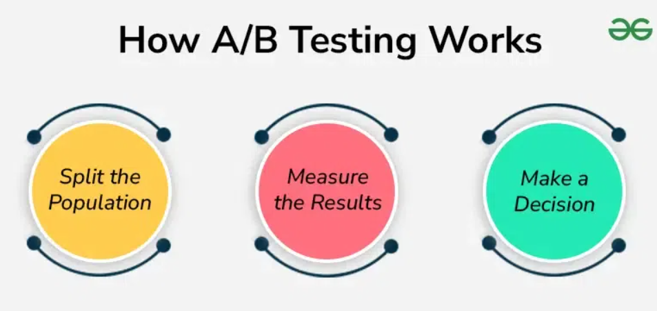

# What is A/B Testing?

A/B testing is a method used to compare two versions of a product element—such as a feature, design, or layout—to see which performs better.

It allows teams to test ideas on a small group of users before launching changes to everyone.

## Why Use A/B Testing?

- Helps make **data-driven decisions**
- Reduces risk by testing before full release
- Improves conversion rates and user engagement through evidence-based changes

## Example Scenario

In a shopping app:

- **Version A**: Products are displayed **horizontally**
- **Version B**: Products are displayed **vertically**

**Goal**: Find out which version leads to more purchases.

Instead of applying the change to all users, A/B testing shows each version to a different user group.

## How A/B Testing Works

### 1. Split the Users

- Randomly divide users into two groups:
  - **Group 1** sees Version A (control)
  - **Group 2** sees Version B (variant)

### 2. Track the Data

Measure key metrics like:
- **Conversion Rate** (e.g., purchases)
- **Engagement** (e.g., time spent, clicks)

### 3. Decide Based on Results

- If Version B performs better → **roll it out**
- If not → **keep Version A** and revisit the idea

## A/B Testing Results Table

| Version    | Conversion Rate |
|------------|------------------|
| Version A  | 25%              |
| Version B  | 5%               |

**Conclusion**: Version A performs better. The new layout in Version B didn’t increase conversions and should not be rolled out.

