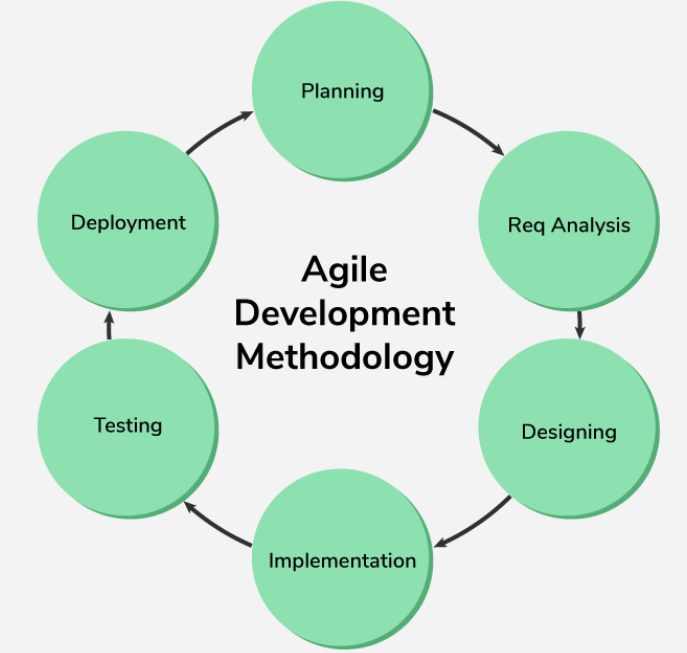

# Importance of Iterative Building

## What is Waterfall Methodology?

The **Waterfall methodology** is a linear process for product development.

**Phases in Waterfall:**

- **Ideation**: Generating the initial idea.  
- **Design**: Creating detailed designs based on the idea.  
- **Development**: Building the product according to the designs.  
- **Quality Assurance (QA)**: Testing the product to ensure it meets quality standards.  
- **Launch**: Releasing the product to the market.

> Sequence:  
**Ideation → Design → Development → QA → Launch**

In the Waterfall model, each stage must be completed before moving to the next. It’s straightforward and easy to manage due to its linear nature.  
However, it can be **inflexible**, as going back to a previous stage is difficult once it’s completed.

## What is Agile Methodology?

**Agile** is a flexible, iterative approach to product development.  
Unlike Waterfall, Agile is not a strict step-by-step process, but a **mindset** focused on **continuous improvement** and **customer involvement**.

### Key Characteristics:

- **Iterative Development**: Deliver in small, incremental parts.  
- **Customer Involvement**: Continuous feedback and adjustments.  
- **Flexibility**: Quick adaptation to change.

### Example Agile Iterations:

- **Iteration 1**: Plan → Develop → Test → Review → Deploy  
- **Iteration 2**: Plan → Develop → Test → Review → Deploy  
- **Iteration 3**: Plan → Develop → Test → Review → Deploy  

Agile allows **continuous feedback** and faster course correction.

## Differences Between Waterfall and Agile

| **Factor**              | **Waterfall**                                | **Agile**                                         |
|------------------------|----------------------------------------------|--------------------------------------------------|
| **Flexibility**         | Rigid, linear process                        | Highly flexible and adaptable                   |
| **Customer Involvement**| At the beginning and end only                | Continuous throughout the process               |
| **Risk Management**     | Higher risk due to long development cycles   | Lower risk with shorter, iterative cycles       |
| **Timeline**            | Longer timelines, no early releases          | Shorter cycles, frequent releases               |

## Cone of Uncertainty

The **Cone of Uncertainty** shows how uncertainty decreases over time in a project.

- At the start, uncertainty is high.
- As the project progresses and becomes better defined, uncertainty decreases.

> This concept helps in choosing between **Agile** and **Waterfall**, depending on how well-defined the project is initially.

## When to Use Waterfall

Waterfall works best when requirements are clear and stable.

✅ **Use Waterfall for:**

- **New Products** with fixed initial requirements  
- **Client Projects** with clearly defined, unchanging specs

## When to Use Agile

Agile is ideal when flexibility and fast feedback are key.

✅ **Use Agile for:**

- **Existing Products** requiring continuous updates  
- **Complex Projects** where requirements may evolve

