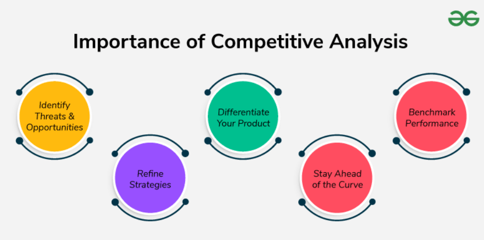

# What is Competitive Analysis?

Competitive analysis means studying your competitors in a structured way.  
You learn who they are, what they offer, and how they run their business.

## Importance of Competitive Analysis

1. **Identify Threats and Opportunities**  
   - Spot new competitors or innovations that could affect your product.  
   - Find chances to solve customer problems better.

2. **Differentiate Your Product**  
   - Understand what makes your product unique in the market.

3. **Benchmark Performance**  
   - Compare your product’s performance with others.  
   - See what works well and where to improve.

4. **Refine Strategies**  
   - Use insights from competitors to guide planning and decisions.

5. **Stay Ahead of the Curve**  
   - Monitor trends and tech developments to stay competitive.

## Types of Competitors

### 1. Direct Competitors  
Companies that sell the **same or very similar products**.  
**Example:** Head & Shoulders vs. Pantene (both are shampoo brands)

### 2. Indirect Competitors  
They offer different products but **solve the same customer need**.  
**Example:** Uber vs. Toyota  
- Uber offers rides.  
- Toyota sells cars.  
- Both help with transportation.

## Example: Duolingo vs. Babbel (Language Learning Apps)

| **Parameter**             | **Duolingo**                                 | **Babbel**                                     |
|--------------------------|----------------------------------------------|------------------------------------------------|
| **Company Overview**      | Offers over 30 languages, global reach       | Focuses on 14 languages with clear structure   |
| **Products & Services**   | Free with ads; also has premium plans        | Paid plans only, no free version with ads      |
| **Marketing Strategies**  | Targets casual learners; fun and easy to use | Targets serious learners; grammar-focused      |
| **Strengths**             | Many language options, fun UI                | Strong grammar support, structured lessons     |
| **Weaknesses**            | Basic grammar content                        | Less engaging for casual learners              |
| **Market Position**       | Fast-growing and globally popular            | Profitable and strong in select markets        |

# Online Research Tools

These tools help you gather useful information about your competitors without leaving your desk.  
Common tools include: **SimilarWeb**, **SEMrush**, **Ahrefs**, **Crunchbase**.

## Website Analysis

- Understand how competitor websites are structured and what content they offer.  
- See how users interact with their websites.

## Traffic Analysis

- Find out where your competitor’s traffic is coming from.  
- Identify which channels (search, ads, social, etc.) are performing well.

## Backlink Profiles

- Discover which blogs and websites are linking to your competitors.  
- Helps you find backlink opportunities.

## SEO Performance

- Track how your competitors are ranking in search engines.  
- Analyze keywords and optimize accordingly.

## Company Information

- Use tools like **Crunchbase** to explore company details:  
  - Founders  
  - Funding rounds  
  - Key milestones  
  - Recent news

# Social Media Listening Tools

These tools help monitor what people are saying about your competitors on social platforms.  
Examples: **Hootsuite**, **Brandwatch**, **Mention**, **Sprout Social**

## Track Brand Mentions

- See how often and where your competitors are mentioned.

## Identify Influencers

- Find influencers talking about your competitors.  
- They could be valuable for your own brand too.

## Sentiment Analysis

- Understand the tone of conversations:  
  - Are users happy, frustrated, or neutral?

## Monitor Social Campaigns

- Watch how your competitors run their social media campaigns.  
- Spot what’s working and what’s not.

# Data Analytics Tools

These tools give deep insights into user behavior and marketing performance.  
Popular ones: **Google Analytics**, **Adobe Analytics**, **Mixpanel**

## Track Website Traffic

- See how many people visit and what pages they explore.

## Analyze User Behavior

- Follow how users navigate your site.  
- Spot where they drop off or lose interest.

## Segment Your Audience

- Divide users by age, location, behavior, etc.  
- Helps in targeted campaigns.

## Measure Campaign Performance

- Track key metrics:  
  - Clicks  
  - Conversions  
  - Time spent on site

