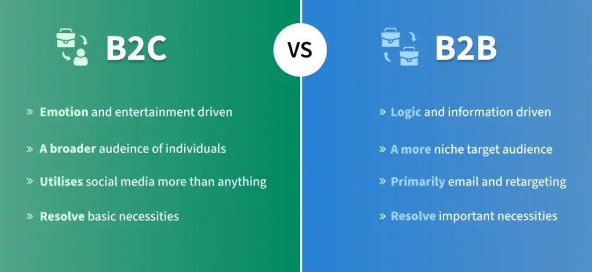

# B2B vs B2C Product Management

Understanding the differences between B2B and B2C product management is essential for aligning your product strategy, development, and user engagement.

## What Are B2B and B2C?

- **B2B (Business-to-Business)**: Products/services sold to other businesses.  
  _Example_: Slack, Salesforce  

- **B2C (Business-to-Consumer)**: Products/services sold directly to individual users.  
  _Example_: Instagram, Google Maps  

> Note: Some products (like Google Maps) serve both B2B and B2C audiences.

## Key Differences

### 1. Customers
- **B2B**: Businesses with specialized, use-case driven needs.  
- **B2C**: General consumers with broad, everyday needs.

### 2. Sales Cycle
- **B2B**: Longer, involves multiple stakeholders and formal approvals.  
- **B2C**: Short, often emotional or impulsive purchases.

### 3. Customer Relationships
- **B2B**: Long-term, customized service; losing one client can have major impact.  
- **B2C**: Short-term or transactional; individual users carry less weight.

### 4. Pricing
- **B2B**: High-value, contract-based (e.g., annual SaaS licenses).  
- **B2C**: Lower, volume-driven pricing (e.g., app subscriptions).

### 5. Marketing & Sales
- **B2B**: Targeted marketing (e.g., LinkedIn, industry events, whitepapers).  
- **B2C**: Broad outreach (e.g., social media ads, influencers, YouTube).

### 6. User Experience (UX)
- **B2B**: Functionality-first, complex workflows.  
- **B2C**: Simplicity, delight, and ease-of-use are key.

### 7. Customization & Integration
- **B2B**: Requires integration with enterprise tools, flexible setups.  
- **B2C**: Minimal customization; optimized for scalability.

### 8. Decision Making
- **B2B**: Group-based, formal evaluation process.  
- **B2C**: Individual, quick decision-making.

### 9. Market Evolution
- **B2B**: More stable, conservative changes.  
- **B2C**: Rapid, trend-driven innovation.

### 10. Competition
- **B2B**: Harder entry, trust and relationships matter most.  
- **B2C**: Competitive but easier to enter (e.g., new apps).

### 11. Scalability
- **B2B**: Customization limits scalability.  
- **B2C**: High scalability — one product fits many users.

### 12. User Research & Testing
- **B2B**: Smaller user base, relies on deep interviews.  
- **B2C**: Large-scale A/B testing, behavioral data.

## How It Affects Product Management

### Common Ground
- **User-Centered Design**: Understanding the user is key in both.  
- **Iterative Development**: Frequent updates based on feedback.

### Approach Differences

- **B2B PMs**:
  - Emphasize stakeholder relationships and product reliability.
  - Work closely on integrations and technical scalability.

- **B2C PMs**:
  - Focus on fast-paced experimentation.
  - Prioritize usability, retention, and visual appeal.
