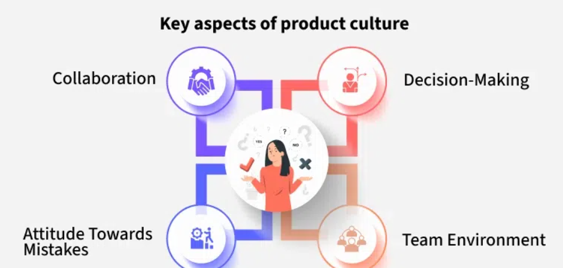
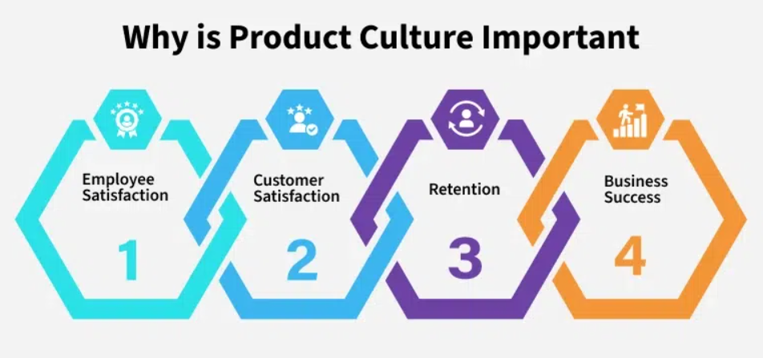

# Building a Product Culture

Product culture defines how teams collaborate to build and deliver products. It’s not about perks like foosball tables—it’s about mindset, communication, and shared values.

## What is Product Culture?

Goes beyond superficial benefits. It’s shaped by:

- **Processes**
- **Communication style**
- **Decision-making habits**
- **Attitude toward innovation and failure**

## Key aspects of product culture

## Why Product Culture is Important

- **Employee Satisfaction**: Happier, more engaged teams.
- **Customer Satisfaction**: User-focused products meet real needs.
- **Retention**: Positive environment lowers turnover.
- **Business Success**: Better collaboration → higher revenue and impact.
  

## How Product Managers Can Contribute

### Focus on the User
- Champion user-first thinking across the team.
- Advocate for solving real user problems.

### Foster Open Communication
- Encourage feedback, questions, and honest discussions.
- Set up transparent tracking and updates.

### Lead by Example
- Run retrospectives and share blockers/progress.
- Promote collaboration and continuous improvement.

## Measuring and Improving Product Culture

### 1. Quantitative Metrics
- **Team NPS**: Likelihood team members recommend working at the company.
- **Customer Metrics**:
  - CSAT (Customer Satisfaction Score)
  - Feature adoption rate
- **Experimentation Rate**: How often the team tests new ideas.

### 2. Qualitative Feedback
- Use surveys, 1:1 meetings, and open team discussions to uncover culture gaps.

### 3. Treat Culture Like a Product
- Run small culture experiments (e.g., new meeting formats, feedback loops).
- Measure impact → Iterate → Improve team experience.
