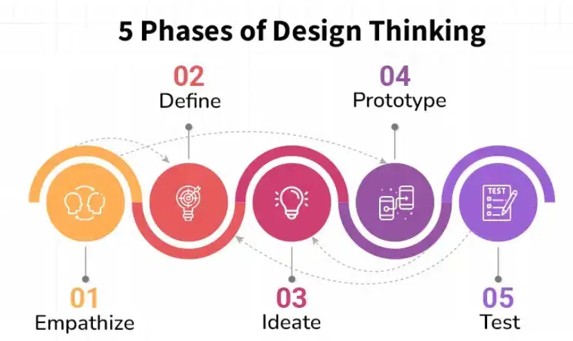
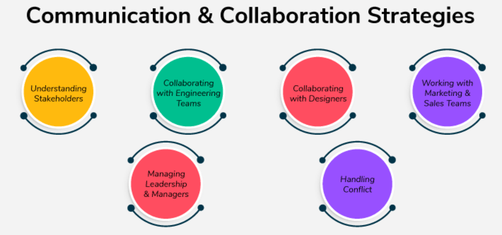

# Design Thinking

## What is Design Thinking?

Design Thinking is a **user-centered approach** to solving problems.

- Focuses on understanding user needs first.
- Helps find the right problems before building solutions.

As a **Product Manager (PM)**:
- Your job is to define the problem clearly.
- Designers work on shaping the solution.
- Both PMs and designers collaborate closely to create meaningful products.

## Why is Design Thinking Important?

- Builds stronger collaboration between PMs and designers.
- Ensures the product solves **real** user problems.
- Encourages **creative and innovative thinking**.
- Supports a **user-first mindset**, key to product success.

## The Design Thinking Process

## Iterative Nature of Design Thinking

- It's not a strict linear process.
- You often loop between stages.
- Example: Testing may uncover new problems and lead you back to redefining the problem.

> This flexibility ensures the solution truly fits user needs.

## Working with Designers and UX Researchers

- PMs help **frame the problem**; designers help **craft the solution**.
- Involve designers and UX researchers **early**, not just during execution.
- Encourage a **collaborative team mindset** for better results.

> Great solutions come from shared understanding and teamwork.

# Communication & Collaboration Strategies

## Why It Matters

Communication and collaboration are essential in product development.

- Think of them as the **oil in a machine**—without them, progress slows or stops.
- They help keep the process smooth, teams aligned, and problems solved quickly.

## Role of the PM in Communication

As a **Product Manager**, you're the **main connector** between teams:

- You align engineering, design, marketing, sales, and more.
- You make sure everyone is on the same page about:
  - Goals
  - Timelines
  - Progress
  - Responsibilities

Clear communication helps avoid:
- Confusion  
- Overlapping tasks  
- Missed expectations

## Why Communication & Collaboration Matter

- Poor communication can lead to **delays**, **wasted effort**, and **unsuccessful products**.
- Effective collaboration ensures:
  - Everyone contributes their expertise.
  - Teams stay motivated and engaged.
- Good communication builds:
  - **Team trust**
  - **Faster problem-solving**
  - **Better product outcomes**

