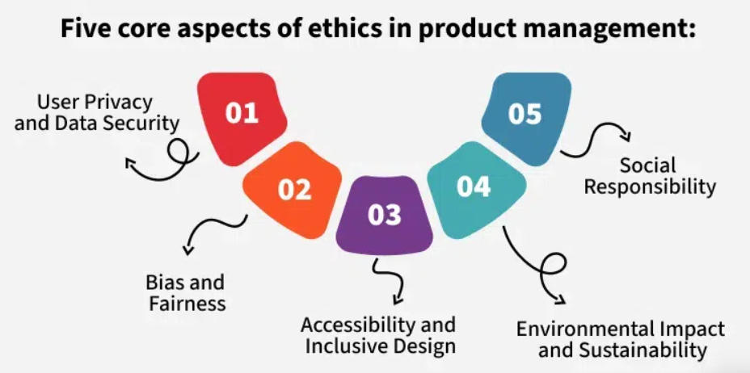
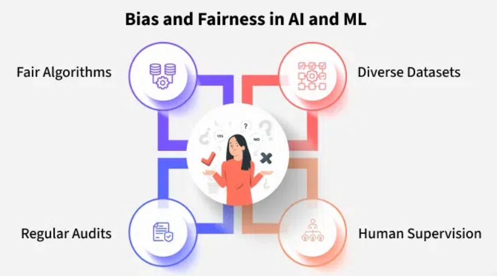

# Ethical Considerations in Product Management

**Ethics in product management** refers to the guiding moral principles behind how products are designed, built, and deployed.

- Focuses on fairness, privacy, inclusivity, sustainability, and social responsibility.  
- **Goal:** Ensure a positive impact on users, society, and the environment.

## Five Core Aspects of Ethics in Product Management

### 1. User Privacy and Data Security

**Objective:** Protect user data and build trust.

**Key Guidelines:**
- **Data Minimization:** Only collect essential data.  
- **Informed Consent:** Explain why data is collected and how it’s used.  
- **Encryption:** Secure all user data.  
- **Regular Audits:** Identify and fix security vulnerabilities.  

---

### 2. Bias and Fairness (Especially in AI/ML)

**Objective:** Prevent harmful discrimination and promote fairness.

**Key Guidelines:**
- **Diverse Datasets:** Avoid skewed or narrow training data.  
- **Human Supervision:** Regularly monitor for algorithmic bias.  
- **Regular Audits:** Assess and correct unfair model behavior.  
- **Fair Algorithms:** Use adversarial debiasing or fairness-aware techniques.  

**Example:** AI hiring tools showing racial/gender bias — mitigated through ethical design and supervision.

---

### 3. Accessibility and Inclusive Design

**Objective:** Ensure products are usable by individuals with varying abilities.

**Key Guidelines:**
- **WCAG Compliance:** Follow accessibility standards.  
- **User Research with Diverse Groups:** Include people with disabilities in testing.  
- **Clear Communication:** Use simple language and clear structure.  
- **Assistive Features:** Enable screen readers, font adjustments, alt text, etc.  

---

### 4. Environmental Impact and Sustainability

**Objective:** Minimize ecological harm through thoughtful design and operations.

**Key Guidelines:**
- **Sustainable Materials:** Use biodegradable or recycled materials.  
- **Energy-Efficient Processes:** Use low-energy tech and optimize operations.  
- **Reduce Waste:** Follow reduce, reuse, recycle principles.  
- **Lower Carbon Footprint:** Adopt scalable systems and renewable energy.  

---

### 5. Social Responsibility

**Objective:** Consider the broader societal impact beyond just the product's users.

**Key Guidelines:**
- **Impact Assessment:** Identify possible harm before launch.  
- **Fair Practices:** Avoid exploiting users or spreading misinformation.  
- **Transparency:** Be honest about product intentions and limitations.  

## Deep Dive: Ethical Focus Areas

### User Privacy and Data Security in Project Management

Maintaining privacy and security is essential in project management—especially when handling personal or sensitive data. Good practices ensure user trust, legal compliance, and risk reduction.

*1. Data Minimization*

- **Collect only essential data** required for core project functions.  
- Enforce clear **data retention policies** to avoid storing unnecessary information.  
- **Anonymize sensitive data** when possible to reduce impact in the event of a breach.  

---

*2. Informed Consent*

- **Communicate clearly** what data is being collected, why it’s needed, and how it will be used.  
- Ensure users are **aware of their data rights** and privacy controls.  
- Always obtain **explicit consent** before collecting or processing personal information.  

---

*3. Data Encryption*

- Use **strong encryption techniques** for both data at rest (stored) and data in transit (shared).  
- Prevents **unauthorized access, leaks, or tampering** during storage and transmission.  

---

*4. Regular Security Audits*

- Perform **frequent security assessments** to identify and fix system vulnerabilities.  
- Stay compliant with **data protection laws** (e.g., GDPR, HIPAA).  
- Continuously **update security policies** based on audit outcomes and emerging threats.  

---

### Bias and Fairness in AI/ML

- **Fair Algorithms:** Implement fairness constraints and debiasing techniques.  
- **Diverse Datasets:** Ensure training data is representative.  
- **Regular Audits:** Use fairness metrics and third-party evaluations.  
- **Human Supervision:** Include ethics committees and manual review of critical decisions.  

---

### Accessibility and Inclusive Design
- **WCAG Compliance**  
- **Diverse User Testing**  
- **Clear Language and Structure**  
- **Visual/Audio Aids:** Alt text, captions, visual indicators.  

---

### Environmental Impact and Sustainability
#### 1. Sustainable Materials
Use bamboo, recycled plastics, organic fibers, etc.

#### 2. Energy Efficiency
Apply low-energy tech like LEDs and efficient HVAC.

#### 3. Reduced Waste
Implement circular economy practices, minimal packaging, and repurposing.

#### 4. Carbon Footprint Reduction
Use solar/wind power and invest in carbon offsets.

