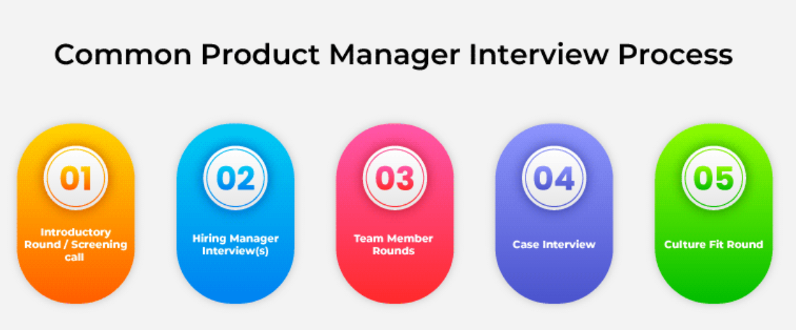

# The Interview Process: What to Expect

## 1. Screening Call

- **Conducted by**: HR or hiring manager (in smaller companies).
- **Purpose**: Initial fit check — skills, experience, and communication.

**Example Questions:**
- “Have you worked with cross-functional teams?”
- “Have you managed roadmaps for B2B products?”

## 2. Hiring Manager Round

- **Focus**: Deeper dive into experiences, behavioral and situational responses.
- **Also evaluates**: Fit with team and manager expectations.

**Tip**: Ask questions about:
- Team culture
- Working style
- Performance expectations

## 3. Team Member Rounds

- **Participants**: Designers, engineers, marketers, or leadership.
- **Focus**: Cross-functional collaboration and communication.

**Tip**:
- Demonstrate openness to ideas.
- Emphasize teamwork and alignment with shared goals.

## 4. Case Interviews

- **Purpose**: Evaluate problem-solving, product thinking, and analytical ability.

**Types**:
- **Take-home case**: Complete independently and present later.
- **Real-time case**: Solve live during the interview.

**Key Tips**:
- Structure your approach clearly.
- Explain your reasoning aloud.
- Collaborate with the interviewer.

## 5. Culture Fit Round

- **Purpose**: Assess alignment with company values and working norms.
- **Note**: Often embedded throughout other rounds.

## Best Practices for PM Interviews

### 1. Research the Company & Role
Understand:
- Mission, values, product, revenue model
- Recent product updates or launches
- Job description keywords (hint at core skills)

### 2. Practice Common Questions
| Question | What to Focus On |
|----------|------------------|
| Tell me about yourself. | Highlight relevant, recent accomplishments. |
| Why this role/company? | Align your goals with company vision. |
| Biggest failure? | What you learned and how you improved. |
| How do you prioritize? | Use RICE, MoSCoW, or other frameworks. |

### 3. Case Interview Preparation
- **Mindset**: It’s about approach, not the perfect answer.
- Clarify the problem first.
- Think out loud.
- Use frameworks like **AARM** (Acquisition, Activation, Retention, Monetization).

### 4. Ask Good Questions
Show curiosity and initiative.

**Examples**:
- “What current challenges is the team facing?”
- “How is product success measured here?”

### 5. Follow-Up
- Send a thank-you email within 24 hours.
- Reinforce interest and reference something specific from the conversation.

## Common Interview Questions & What They Reveal

| Question | What It Evaluates |
|----------|--------------------|
| Tell me about yourself. | Relevance of experience to the role |
| Why this company/role? | Motivation and value alignment |
| Describe a challenging project. | Leadership, problem-solving, execution |
| How do you handle conflicts? | Teamwork, communication, conflict resolution |
| Describe a failure. | Growth mindset, resilience |

## Case Interviews: Key Insights

### Problem-Solving
- Break big problems into manageable steps.
- Focus on user impact and trade-offs.

### Collaboration
- Treat interviewer as a partner.
- Ask clarifying questions and show curiosity.

### Analytical Thinking
- Use a clear, logical structure.
- Explain your thought process aloud.

## Recommended Book

**Decode and Conquer by Lewis Lin**
- Case interview frameworks
- Product design and strategy samples
- Behavioral interview tips specific to PMs
