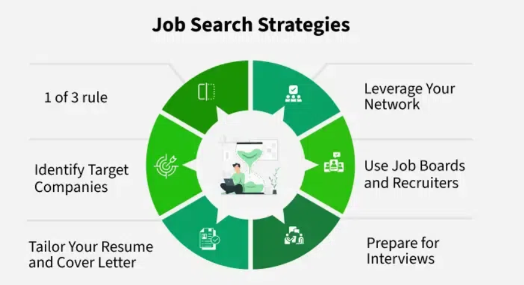

# Networking and Job Search in Product Management

## I. Why Networking Matters for Product Managers

- **Career Growth**: Referrals increase your chances of interviews compared to applying through job portals.
- **Community Size**: PM community is tight-knit — reputation (good or bad) spreads quickly.
- **Learning & Development**: Continuous learning through peer insights and real-world experiences.
- **Industry Awareness**: Stay informed on tools, trends, frameworks, and thought leadership.
- **Social Media Power**: Platforms like LinkedIn and Twitter/X make it easier but also more competitive — meaningful connections matter more than quantity.

## II. Strategies for Effective Networking

### Attend Industry Events
- Join workshops, webinars, product meetups, and hackathons.

### Leverage Online Platforms
- Use **LinkedIn** to follow PM leaders, comment on posts, and engage in conversations.
- Use **X (Twitter)** to follow industry experts and share learnings.

### Join PM Communities
- Examples: Product School, Mind the Product, Women in Product, Slack/Discord communities.

### Find Mentors
- Reach out on LinkedIn or through formal mentorship platforms.
- Internal mentors at your workplace can also provide role-specific guidance.

### Follow Up Regularly
- Maintain relationships with your network (e.g., message after 3–6 months or after a shared event).

### Pay It Forward
- Share job openings, refer others, or provide feedback — build goodwill.

## III. Job Search Strategies for Product Managers

### The One of Three Rule
To ease transitions, only change **one** of the following at a time:
- **Role** (e.g., from UX designer to PM)
- **Location** (e.g., shift cities/countries)
- **Industry** (e.g., from FinTech to Healthcare)

> Changing more than one factor at once increases the difficulty of the switch.

### Steps to Target a PM Role

#### Identify Target Companies
- List companies whose products you admire or whose mission aligns with yours.
- Prioritize based on values, team size, culture, and growth opportunities.

#### Tailor Your Resume & Cover Letter
- Match keywords from the job description.
- Showcase metrics and impact (e.g., “Launched feature X that increased engagement by 25%”).

#### Leverage Your Network
- Ask for referrals.
- Seek insider information on company culture and interview processes.

#### Work with Recruiters
- Build relationships with specialized PM recruiters.
- Be clear on your goals (type of company, role, compensation range).

#### Use the Right Job Boards

| Type         | Platforms                                      |
|--------------|------------------------------------------------|
| General      | LinkedIn, Glassdoor, Hirect                    |
| Remote       | We Work Remotely, Remotive, AngelList/Wellfound|
| Product-Specific | ProductHired, Mind the Product Job Board     |

#### Interview Preparation
- Practice all types of questions:
  - **Product Sense**: Feature prioritization, value delivery.
  - **Execution**: Metrics, trade-offs, implementation risks.
  - **Behavioral**: Teamwork, conflict resolution, stakeholder alignment.
  - **Technical Fluency**: Basics of APIs, data flows, and systems thinking.
- Know your **non-negotiables** (e.g., work-life balance, team structure, growth path).

