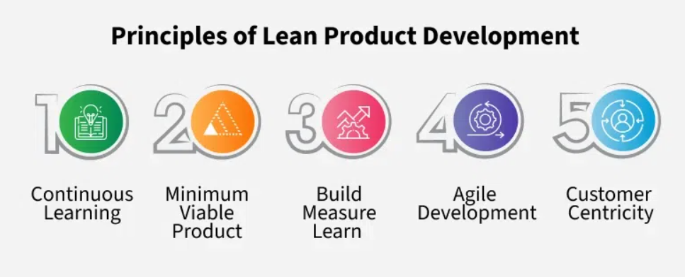
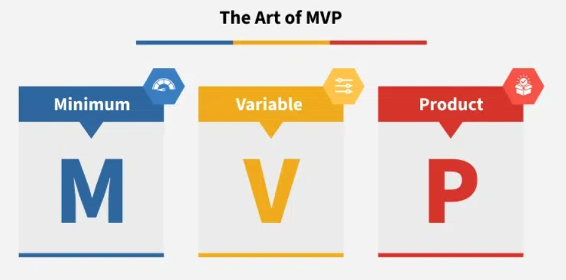
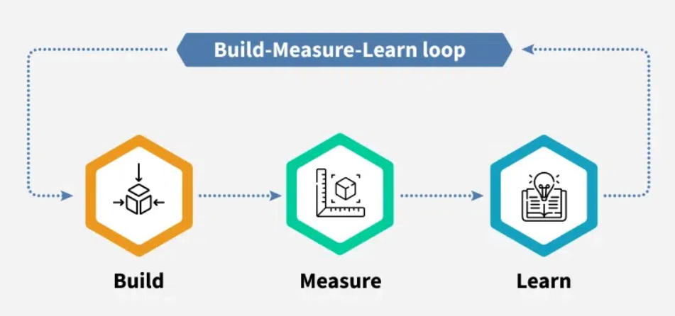

# Lean Product Development

## What is Lean Product Development?

Lean product development focuses on building better products by learning quickly from users and improving based on feedback.

- **Rapid Prototyping**: Build basic versions quickly to test ideas early.
- **Iterative Design**: Regularly update the product based on user input.
- **Efficient Resource Use**: Spend only on what solves real user problems.

## Principles of Lean Product Development

### 1. Continuous Learning
- Keep learning about users, market needs, and product direction.
- Adjust during development, not after.

### 2. Minimum Viable Product (MVP)
- Launch a simple version that solves the core user problem.
- Avoid adding extra features too early.

### 3. Build-Measure-Learn Loop
- **Build**: Start with something simple.
- **Measure**: Get user reactions.
- **Learn**: Improve based on what you discover.

### 4. Agile Development
- Work in short cycles (sprints).
- Respond to feedback and iterate quickly.

### 5. Customer Centricity
- Keep user needs central to every product decision.
- Focus on delivering real value.

## The Art of MVP

An MVP helps test your product idea early.

| Element     | Description                                               |
|-------------|-----------------------------------------------------------|
| **Minimum** | Only must-have features to solve the problem              |
| **Viable**  | Usable enough to provide value and gather feedback        |
| **Product** | Real enough for users to interact with and evaluate       |

## Build-Measure-Learn in Practice

- **Build**: Start with a focused, simple version.
- **Use**: Let real users try it.
- **Learn**: Analyze feedback and improve it.

## Tools and Techniques in Lean Product Development

### User Stories
Describe features from the user’s perspective.
> *Example:* “As a shopper, I want to read reviews so I can choose the best product.”

### A/B Testing
Show different versions to different users and see which performs better.

### Design Thinking
Use empathy and creativity to find innovative user-centered solutions.

### User Interviews
Speak directly with users to understand pain points and goals.

## Benefits of Lean Product Development

- **Increased Efficiency**: Eliminates unnecessary work.
- **Better Customer Satisfaction**: Driven by continuous feedback.
- **Lower Costs**: Avoids building unwanted features.
- **Faster Time to Market**: Launch sooner to validate and iterate.
