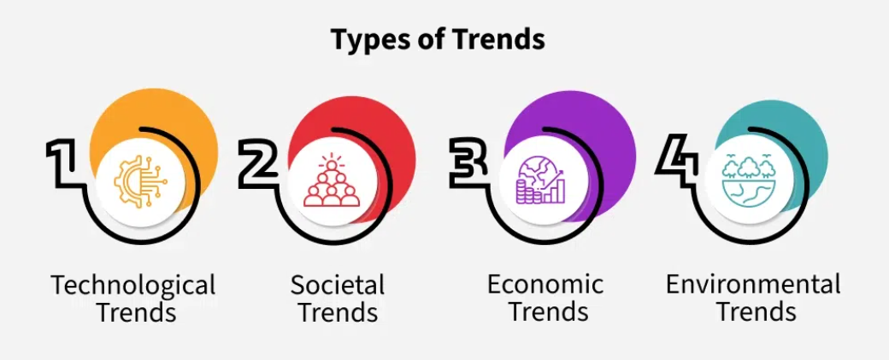

# Trend Analysis and Market Forecasting

## Importance of Market Forecasting and Trend Analysis

Understanding trends and forecasting helps product teams build better strategies and stay competitive.

### Why Do We Need Them?

- **Make Informed Decisions**  
  Spot industry shifts and adjust your approach accordingly.

- **Identify Opportunities and Gaps**  
  Discover unmet customer needs or emerging demands.

- **Mitigate Risks**  
  Forecasts reduce chances of building something users won’t want.

- **Improve Planning**  
  Helps with long-term decision-making and resource allocation.

### Main Goal

To build products that solve real user needs and generate lasting business value.

## Types of Trends

Trends help predict what people will need or expect in the future.

### 1. Technological Trends

- Driven by innovation and emerging tech.  
- Examples: AI, mobile ecosystems, Web3.

### 2. Societal Trends

- Reflect changes in lifestyle, behavior, or values.  
- Examples: Mental wellness focus, digital detox, minimalism.

### 3. Economic Trends

- Based on economic conditions like inflation or market booms.  
- Impacts how consumers spend and prioritize.

### 4. Environmental Trends

- Focused on sustainability and eco-friendly habits.  
- Example: Climate change pushing demand for green products.

## What is Market Forecasting?

Market forecasting means using **trend insights + data analysis** to predict how the market might evolve.  
This helps teams **plan ahead** and **make strategic decisions**.

### Key Components of Market Forecasting

#### 1. Market Research

- Understand the current state of the market.  
- Collect data on customer behavior, preferences, and gaps.

#### 2. Data Analysis

Use techniques such as:

- **Time Series Analysis** — Tracks changes over time.
- **Regression Analysis** — Finds relationships between variables.

#### 3. Scenario Planning

- Prepare for multiple possible future situations.  
- Helps with building flexible product strategies.

## Example: Growth of Electric Vehicles (EVs)

Here’s how forecasting would work for the EV industry.

### Analyze Key Factors

- Government incentives  
- Shifting consumer preferences  
- Technology breakthroughs

### Identify Challenges

- Charging infrastructure gaps  
- High battery prices

### Plan for Scenarios

What if...

- Battery prices fall drastically?  
- New tax benefits are introduced?

### Use Findings to Guide Strategy

- Adjust product features, pricing, or expansion plans based on forecasts.

