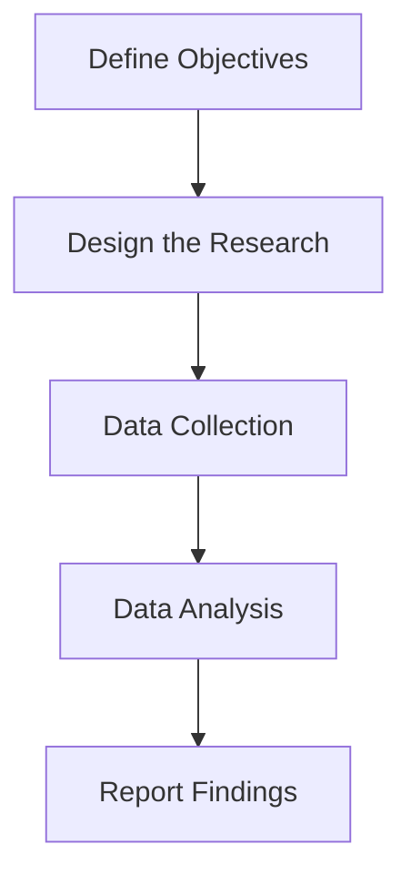
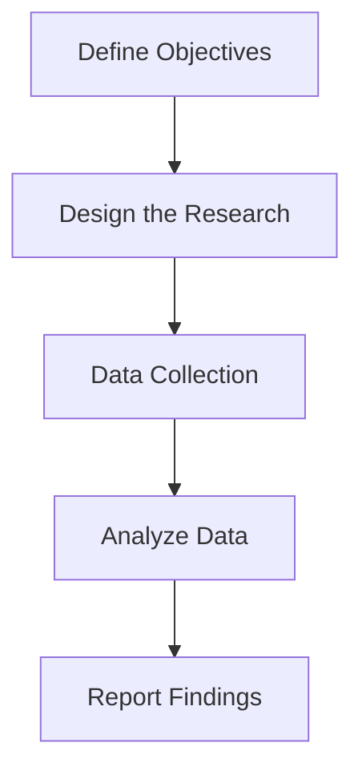

# 📊 Different Market Research Methods

1. **Surveys**  
   - Structured questionnaires used to collect data from many people.  
   - Ideal for gathering **quantitative data** and spotting **trends and patterns**.

2. **Interviews**  
   - One-on-one conversations with users.  
   - Provides rich **qualitative data** but can be time-intensive.

3. **Focus Groups**  
   - Small, moderated group discussions.  
   - Good for gathering **diverse opinions** on a specific topic.  
   - Less time-consuming than individual interviews.

4. **Observations**  
   - Watching users interact with a product in a natural setting.  
   - Reveals **actual user behavior** and uncovers unseen issues.

5. **Experiments (e.g., A/B Testing)**  
   - Compare two or more product versions.  
   - Offers measurable **quantitative data** on user preferences and behaviors.

6. **Social Media Listening**  
   - Monitor platforms, reviews, and forums.  
   - Helps identify **sentiments**, feedback, and recurring issues.  
   - Provides **qualitative insights**.

7. **Data Mining**  
   - Analyze large datasets to uncover patterns and trends.  
   - Helps derive **quantitative insights** from existing data.

## 🧠 Choosing the Right Research Method

Choose your method based on:

- **🎯 Research Goal:** What do you need to find out?
- **💰 Budget:** Can you afford incentives or paid tools?
- **⏱ Timeline:** How quickly do you need results?
- **👥 Target Audience:** What methods best suit their behavior?
- **📈 Desired Data Type:** Do you need **quantitative (numbers)** or **qualitative (opinions)** data?

# Quantitative Market Research?

Quantitative market research involves **collecting and analyzing numerical data** to understand market behavior.  
It helps us:

- Measure market size  
- Identify trends  
- Evaluate performance  
- Validate product decisions  
- Make statistically significant, data-driven decisions

### ✅ Importance of Quantitative Market Research

- **📏 Measuring Market Size**  
  Understand the total addressable market to set realistic targets.

- **📈 Identifying Trends**  
  Spot growth or decline patterns over time.

- **📊 Making Informed Decisions**  
  Use reliable data, not assumptions.

- **🔍 Validating Assumptions**  
  Test product or marketing ideas with actual numbers.

- **📉 Measuring Performance**  
  Track how campaigns or features are performing.

## 🔄 Process of Conducting Quantitative Market Research

## 🔧 Methods of Quantitative Market Research

Several methods can be used to conduct quantitative market research:

1. **Surveys**  
   - Structured questionnaires distributed to a large audience.  
   - Must be carefully designed to **avoid bias** and ensure **statistical significance**.

2. **Experiments**  
   - Conduct tests like **A/B testing** to compare different product features or variables.  
   - Useful for measuring the **impact of changes** on user behavior.

3. **Secondary Data Analysis**  
   - Use **existing data** from reports, studies, or published research to gain market insights.

4. **Quantifying Observations**  
   - Convert **observational data** into numerical values to identify **patterns and behaviors**.

## 📊 Analyzing Quantitative Data

Analyzing quantitative data involves several key steps:

1. **Summarize Data**  
   - Calculate **averages, medians, and modes** to understand central tendencies.

2. **Identify Trends**  
   - Look for **patterns over time** to detect market growth or decline.

3. **Ensure Statistical Significance**  
   - Check if your sample is **large enough and representative** of the target population.

4. **Use Data Quality Indicators**  
   - Evaluate **response counts and sample diversity** to assess the quality of insights.

## 🧰 Tools for Quantitative Market Research

These tools help conduct and analyze quantitative research efficiently:

- **Excel / Google Sheets** – For quick analysis and organizing data  
- **Survey Tools** – Google Forms, SurveyMonkey for survey creation and distribution  
- **Data Visualization Tools** – Tableau, Looker Studio for visual reports and dashboards  
- **Statistical Analysis Tools** – SPSS, R, Python (Pandas, NumPy) for advanced statistical work

# 💬 Qualitative Market Research

Qualitative market research helps uncover **deeper insights** that numbers alone can't explain.  
While **quantitative research** shows what is happening, **qualitative research** reveals **why** it is happening.

This approach is essential for:

- Exploring complex user issues  
- Understanding behavior  
- Generating innovative ideas

### ✅ Importance of Qualitative Market Research

1. **Understanding Emotions and Stories**  
   - Reveals the emotions and stories behind actions.  
   - Offers a richer, more empathetic view of user experiences.

2. **Exploring Complex Issues**  
   - Helps uncover problems that numbers alone might not highlight.

3. **Generating Ideas**  
   - Direct engagement with users can spark fresh solutions.

4. **Validating Assumptions**  
   - Supports findings from quantitative data with user context.  
   - *Example:* If users prefer using an app at 8 AM, qualitative research explains why.

### 🔄 The Qualitative Research Process

## 🔧 Methods of Qualitative Market Research

1. **In-Depth Interviews**  
   - One-on-one conversations with participants to explore their **thoughts and experiences**.  
   - These should feel natural, like everyday discussions.  
   - Record interviews for later transcription and analysis.

2. **Focus Groups**  
   - Moderated group discussions around specific topics.  
   - Useful for **generating ideas** and observing **group dynamics**.  
   - Encourages diverse perspectives in a shared setting.

3. **Ethnographic Studies**  
   - Observe users in their **natural environment** (e.g., home, work).  
   - Helps understand the **context** of how a product is used.  
   - Reveals deep, real-world insights into user behavior.

4. **Diary Studies**  
   - Participants keep a **log of their daily thoughts, feelings, and actions**.  
   - Provides rich, longitudinal data on how they interact with a product over time.

## 🧰 Tools for Qualitative Market Research

Several tools help conduct and analyze qualitative research effectively:

- **UserZoom**  
  - Platform for scheduling and conducting user interviews.  
  - Supports **recording, note-taking, and transcription** features.

- **Otter.ai**  
  - Converts voice recordings into editable transcripts.  
  - Useful for analyzing long interviews or focus group sessions.

- **NVivo**  
  - Advanced software for **coding, categorizing, and visualizing themes** in qualitative data.  
  - Great for large volumes of open-ended text (like interviews and diary entries).
