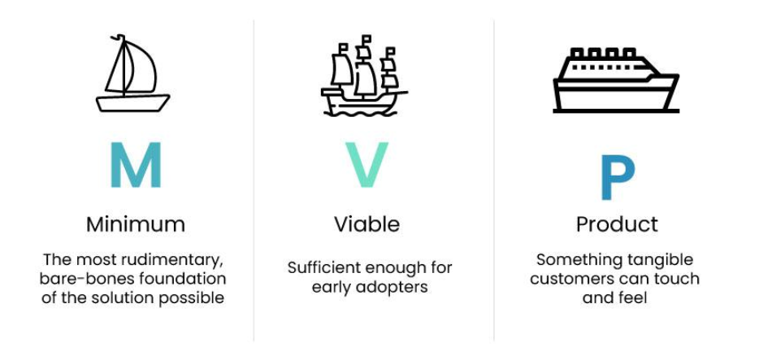

# Minimum Viable Product (MVP)

## What is an MVP?

MVP stands for **Minimum Viable Product**.  
It’s the simplest version of a product that solves a user problem and can be used to gather feedback.

- Includes only core features.
- Helps test an idea early without building the full product.

> Key Point: The MVP should be both **minimal** and **viable**—it must solve a real problem in a usable way.

## Why is an MVP Important?

- **Validates the Idea Early**  
  Test whether your concept works before major investment.

- **Gathers Real User Feedback**  
  Learn what users like or need more of.

- **Reduces Risk**  
  Avoid building features no one wants.

- **Saves Time and Money**  
  Focus on essential features during early stages.

## Analogy: MVP like Transport Prototypes

Instead of building a car one part at a time, offer usable stages:

| Stage         | Example Product  | Purpose                           |
|---------------|------------------|-----------------------------------|
| Stage 1       | Skateboard       | Simple and functional             |
| Stage 2       | Scooter          | Adds comfort                      |
| Stage 3       | Bicycle          | Adds speed and efficiency         |
| Stage 4       | Motorcycle       | Adds power                        |
| Stage 5       | Car              | Final full-feature product        |

At every stage, users can move from A to B—and provide feedback.

## MVP in Agile Environments

Agile encourages quick releases and feedback loops. MVP fits this model well.

- Helps release usable features early.
- Allows for constant learning and iteration.

### Using Dual Track Agile

Agile teams often work in two tracks:

| **Track**        | **Focus Area**                                |
|------------------|-----------------------------------------------|
| **Discovery**    | Explore ideas, validate them via testing      |
| **Delivery**     | Build and release only the validated features |

> Benefit: Only well-tested ideas enter development—saving time and effort.
