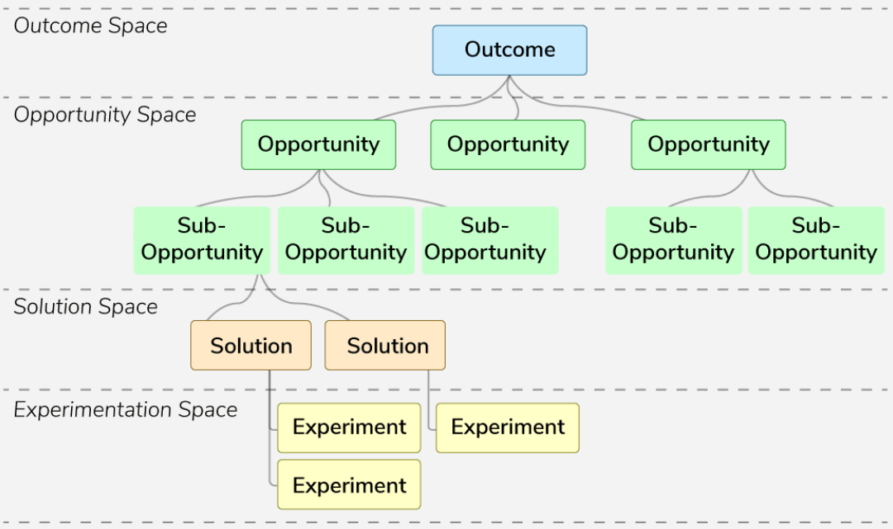

# Opportunity Solution Tree (OST)

The Opportunity Solution Tree (OST) is a visual tool that helps teams map user problems (called opportunities) and connect them to possible solutions.

It helps product managers stay focused on solving real user needs rather than getting distracted by cool ideas that don’t actually help users.

## Components of the OST

### Opportunities
- These are user pain points or problems that need fixing.
- **Example:** If users think a sign-up form takes too long, that's an opportunity to improve it.

### Solutions
- These are ideas for how to fix the problems.
- **Example:** To fix the long sign-up form, a solution could be removing unnecessary steps.

### Experiments
- These are ways to test whether your solution actually works.
- **Example:** Run A/B tests, show users a prototype, or gather direct feedback.

## Benefits of Using an Opportunity Solution Tree

### Focused Ideation
- Helps teams stay centered on solving real user problems.
- Avoids wasting time on features that users don’t really need.

### Better Prioritization
- The visual layout makes it easy to see which problems are most important and worth solving first.

### Evidence-Based Decision Making
- You test your ideas before committing to them.
- Decisions are based on user data, not just assumptions.

### Collaborative Approach
- Brings in ideas from different teams (like design, engineering, and marketing).
- Makes sure solutions are practical and well-rounded.

## Building an Opportunity Solution Tree

| **Step**             | **What to Do**                                                                 |
|----------------------|---------------------------------------------------------------------------------|
| **Start with a Goal**| Choose a specific outcome you want to improve.   *Example:* Increase the number of users who complete the sign-up process. |
| **Identify Opportunities** | Use user research to find where people are struggling.   *Example:* Users feel the registration process is too long or confusing. |
| **Ideate Solutions** | Brainstorm ideas that directly solve those problems.   *Example:* Shorten the registration form or break it into easier steps. |
| **Design Experiments** | Plan how you’ll test each solution.   *Example:* Try out a shorter version of the form and see if more people finish signing up. |
| **Iterate** | Keep the tree updated with what you learn from testing.   Add new problems, tweak solutions, and track what works. |

# Example: Netflix Opportunity Solution Tree

## Goal  
**Increase monthly view time per subscriber**

## Opportunity 1  
**Users want to watch specific content but don’t know which OTT platform it’s available on.**

### Solution 1  
- Partner with search engines  
- Show where content is available across platforms  
- Helps users quickly find out if it's on Netflix

### Solution 2  
- Collaborate with platforms like IMDb  
- Suggest Netflix shows based on user preferences and ratings  
- Makes discovery easier and encourages Netflix viewership

## Opportunity 2  
**Users enjoy romantic comedies but are unsure if they’ll like a particular title.**

### Solution 1  
- Let users set content preferences (genres, themes)  
- Use this data to personalize recommendations

### Solution 2  
- Add a conversational assistant (chatbot)  
- Ask about user mood and suggest suitable content
