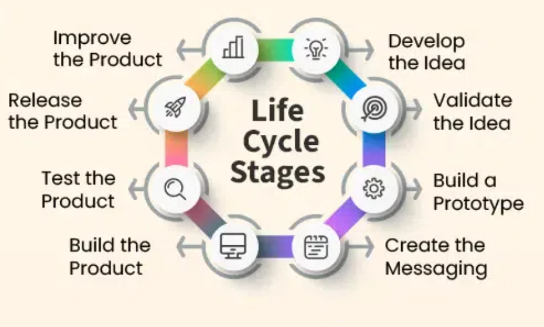

<h1>Product Development Life Cycle</h1>

<ol>
  <li><strong>Ideation</strong></li>
  <li><strong>Concept Development and Validation</strong></li>
  <li><strong>Planning and Design</strong></li>
  <li><strong>Development</strong></li>
  <li><strong>Testing</strong></li>
  <li><strong>Launch</strong></li>
  <li><strong>Post-Launch and Maintenance</strong></li>
</ol>

<h2>1. Ideation</h2>

The starting point where the team identifies problems and comes up with potential solutions.

<ul>
  <li>Identify the main problem that needs solving.</li>
  <li>Brainstorm multiple ideas as possible solutions.</li>
  <li>PM facilitates the process and ensures the focus stays on the right problems.</li>
</ul>

<h2>2. Concept Development and Validation</h2>

This stage tests whether the idea is practical and worth building.

<ul>
  <li>Create a basic prototype (a simple, early version of the product).</li>
  <li>Use the prototype to check if it solves the problem effectively.</li>
  <li>Avoid building the full product before knowing if it works.</li>
</ul>

<h2>3. Planning and Design</h2>

Detailed preparation before development begins.

<ul>
  <li>Plan the development cycle by writing epics and user stories (clear descriptions of features and functions).</li>
  <li>Design the user interface and experience, including layouts, features, and interactions.</li>
  <li>Clear planning and design help developers build exactly what’s needed.</li>
</ul>

<h2>4. Development</h2>

Where the actual building happens.

<ul>
  <li>Developers write code and build the product based on the designs.</li>
  <li>PM ensures deadlines are met, blockers are removed, and the team stays focused.</li>
</ul>

<h2>5. Testing</h2>

Check for bugs and ensure quality before releasing the product.

<ul>
  <li>Quality Assurance (QA) teams test the product thoroughly.</li>
  <li>Testing helps catch issues early and improves product reliability.</li>
  <li>PM should protect this stage from being rushed, even if timelines are tight.</li>
</ul>

<h2>6. Launch</h2>

Releasing the product to users, supported by several key activities.

<ul>
  <li>Coordinate with marketing to promote the product.</li>
  <li>Set appropriate pricing, if applicable.</li>
  <li>Provide user documentation and training (especially for complex features).</li>
  <li>Choose the right release approach (full launch or step-by-step rollout).</li>
</ul>

<h2>7. Post-Launch and Maintenance</h2>

The product is out, but work continues.

<ul>
  <li>Monitor how users interact with the product.</li>
  <li>Collect data to assess performance and user satisfaction.</li>
  <li>Fix bugs and release updates as needed.</li>
  <li>Use insights to begin the next cycle of improvement or ideation.</li>
</ul>
