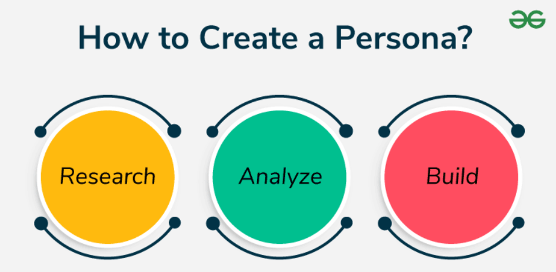
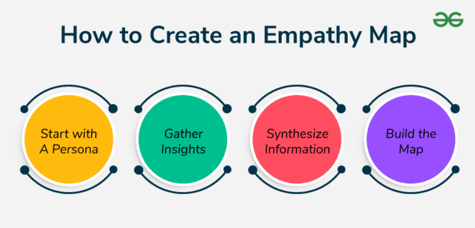

# Personas and Empathy Maps

User personas and empathy maps help product teams understand their users better. They guide product design, features, and messaging by keeping real user needs in focus.

## What Are User Personas?

User personas are imaginary characters that represent different types of real users.

- Based on real research and data
- Help teams understand users’ goals, behaviors, and problems

## Components of a Persona

- **Name and Photo**  
  Give the persona a realistic name and image to relate to.

- **Demographics**  
  Age, job, location — basic info that shapes user behavior.

- **Motivations and Goals**  
  What the user wants to achieve with your product.

- **Pain Points**  
  Frustrations or challenges the user faces.

## How to Create a Persona

1. **Research**  
   Use surveys, interviews, or analytics to collect real data.

2. **Analyze**  
   Find patterns in behaviors, challenges, and goals.

3. **Build**  
   Create a detailed profile with name, goals, motivations, and pain points.

## Example Persona: Sarah the Commuter

- **Name:** Sarah  
- **Age:** 32  
- **Occupation:** Works at a multinational company  
- **Location:** Big city  
- **Goals:** Get to work on time, avoid delays  
- **Pain Points:** Traffic jams, unpredictable routes  
- **Motivations:** Save time, reduce stress

## What Are Empathy Maps?

Empathy maps give deeper insights into how users think, feel, act, and speak.

- Help teams build user-centered solutions  
- Visual and easy to understand  
- Based on real quotes and behaviors

## Components of an Empathy Map

| **Quadrant** | **What It Covers**                        |
|--------------|-------------------------------------------|
| **Say**      | Quotes or comments from the user          |
| **Think**    | Inner thoughts, concerns, or motivations  |
| **Do**       | Actions and behavior during interaction   |
| **Feel**     | Emotions the user experiences             |

## How to Create an Empathy Map

1. **Start with a Persona**  
   Choose an existing persona (e.g., Sarah the Commuter).

2. **Gather Insights**  
   Conduct interviews, field studies, or review existing data.

3. **Synthesize**  
   Spot patterns in what users say, do, feel, and think.

4. **Build the Map**  
   Fill in the four quadrants: Say, Think, Do, Feel

## Example Empathy Map: Sarah the Commuter

| **Quadrant** | **Sarah's Experience**                                              |
|--------------|----------------------------------------------------------------------|
| **Says**     | "I’m late again. This traffic is insane."                            |
| **Thinks**   | "There must be a better route or tool to help me plan better."       |
| **Does**     | Checks maps, changes routes, tries to leave earlier                  |
| **Feels**    | Stressed, anxious, frustrated, helpless                              |

## How They Help in Product Management

- **Prioritize Features**  
  Focus on what truly solves the user's problem.

- **Map the User Journey**  
  See every step users take and identify pain points.

- **Improve Communication**  
  Align teams and stakeholders with a shared view of the user.

- **Refine Marketing**  
  Create targeted messages that match user motivations.
