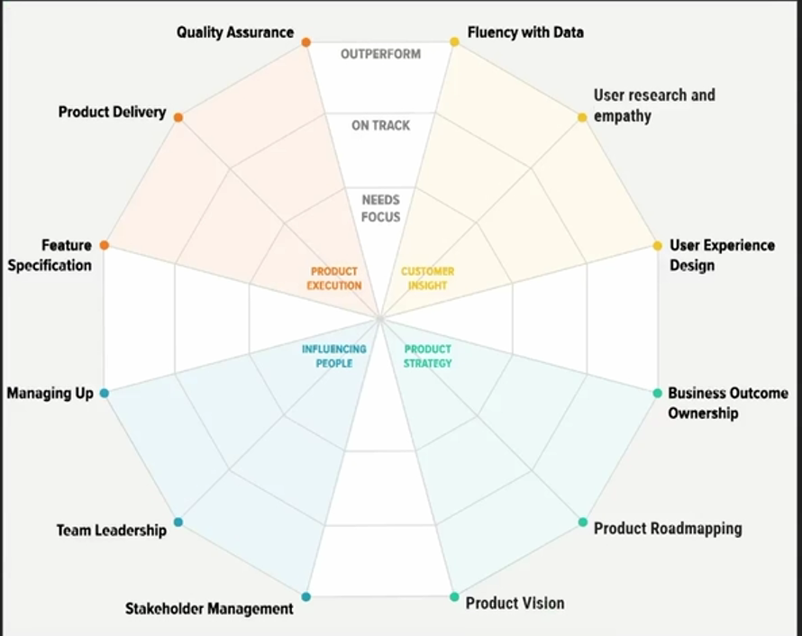

# Role of a PRODUCT MANAGER

A Product Manager (PM) acts as the nexus between different stakeholders, including customers, developers, designers, and business leaders, guiding a product from concept to market and beyond.

## Key Responsibilities of a Product Manager

- Product Execution  
- Customer Insight  
- Product Strategy  
- Influencing People

## Product Execution  
Turning product ideas into real, working products.

### Feature Specification
- Convert customer needs into clear development guidelines  
- Prioritize features based on impact and feasibility  

### Product Delivery
- Coordinate between teams to keep development smooth and on time  
- Manage product updates and improvements using feedback  

### Quality Assurance
- Ensure the product works well through testing  
- Collect and apply user feedback to make the product better  

## Customer Insight  
Knowing your users is key to building the right product.

### User Research & Empathy
- Use interviews, surveys, and tests to understand user needs and pain points  
- Truly care about solving user problems through the product  

### Working with Data
- Analyze how users interact with the product  
- Make smart product decisions backed by real data  

### User Experience Design
- Collaborate with designers to build intuitive and clean interfaces  
- Keep users at the center of all design choices  

## Product Strategy  
Setting the long-term direction and plan for the product.

### Product Roadmap
- Plan out features, goals, and key milestones over time  
- Align the roadmap with business goals and market trends  

### Product Vision
- Create and communicate a clear, inspiring vision for the product  
- Help everyone on the team understand the “why” behind the work  

### Ownership of Results
- Take responsibility for the product’s success and performance  
- Continuously improve the product based on results and feedback  

## Influencing People  
A PM’s success depends on working well with others.

### Leading the Team
- Motivate and support your team to do their best work  
- Encourage open communication and teamwork  

### Managing Stakeholders
- Keep key people (executives, customers, partners) informed and aligned  
- Handle conflicts and find common ground  

### Managing Up
- Share progress with senior leaders clearly and confidently  
- Influence leadership decisions to support the product’s growth  

# Flavours of a PM

