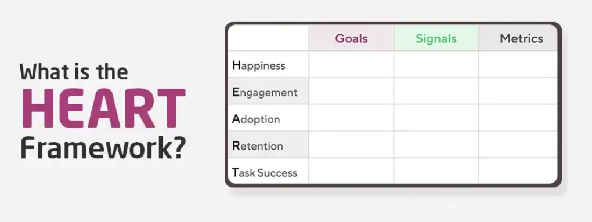

# Product Metrics

## What Are Product Metrics?

Product metrics are numbers or data points that show how well your product is doing.

They track everything from user behavior to product performance—helping you make informed decisions.

> Think of metrics as a guide. Without them, steering your product is like driving with your eyes closed.

## Why Are Metrics Important?

### 1. Measure Progress
- Understand how your product is performing.
- Answer questions like: Are more people using the product? Are they returning?

### 2. Identify Issues
- Detect where users face problems or drop off.
- Metrics can pinpoint what’s going wrong and where.

### 3. Validate Assumptions
- After launching a new feature, check if it’s delivering expected results.
- Helps decide whether to keep, improve, or remove the feature.

### 4. Communicate Success
- Show clear proof of progress and performance.
- Use metrics to celebrate wins or highlight areas needing attention.

> **Key Idea:** You can only improve what you can measure.  
> Without data, improvement is just guesswork.

# The AARRR Framework (Pirate Metrics)

The AARRR Framework, created by **Dave McClure**, helps track how users move through a product—starting from discovering it to becoming loyal, paying customers. It breaks down into five key stages:

## 1. Acquisition  
**How do users find you?**

This stage looks at how people first hear about or come across your product.  
It could be through search engines, social media, word of mouth, or ads.

**Key Metrics:**
- **Website Visits:** Number of people visiting your site and where they’re coming from.
- **App Downloads:** Number of users installing your app—shows initial interest.

## 2. Activation  
**Are users having a good first experience?**

This focuses on whether users take a key action soon after joining (like signing up or trying a core feature).  
Good onboarding makes a big difference here.

**Key Metrics:**
- **Activation Rate:** Percentage of users who complete a key task (e.g., sign-up or finish tutorial).
- **Onboarding Completion:** Percentage of users who finish the first steps after joining.

## 3. Retention  
**Do users keep coming back?**

Retention shows if users continue using your product over time.  
High retention usually means users find the product useful.

**Key Metrics:**
- **Monthly Active Users (MAU):** Number of users who return and use the product every month.
- **Churn Rate:** Percentage of users who stop using the product over a set period.

## 4. Revenue  
**Are users paying for your product?**

This stage measures how well you turn users into paying customers.  
It's about generating income from your product.

**Key Metrics:**
- **Average Revenue Per User (ARPU):** How much money you earn from each user on average.
- **Conversion Rate:** Percentage of users who make a purchase or upgrade to a paid plan.

## 5. Referral  
**Do users tell others about your product?**

If people are recommending your product, it means they find value in it.  
This stage focuses on word-of-mouth growth.

**Key Metrics:**
- **Referral Rate:** How many users are inviting others to try your product.
- **Referral Conversion:** How many of those referred users actually sign up or become active.

## The AARRR Funnel in Order:

**Acquisition → Activation → Retention → Revenue → Referral**

This funnel helps product teams focus on every stage of the user journey—so they can improve user experience, increase revenue, and encourage long-term loyalty.

# Applying AARRR to Product Strategies

To get the most out of the AARRR framework, product managers can use practical strategies at each stage of the funnel:

## Use Analytics Tools

Track how users move through each AARRR stage using tools like:

- **Google Analytics**
- **Mixpanel**
- **Heap**

**Purpose:**  
Helps you identify drop-off points and optimize weak stages in the funnel.

## Run A/B Tests

Test different versions of:

- Sign-up flows
- CTAs (Call-to-Actions)
- Landing pages

**Focus Areas:**  
Most effective at the **Activation** and **Revenue** stages.

## Improve Onboarding

Make onboarding:

- Clear and user-friendly
- Focused on value delivery
- Interactive or guided (e.g., tooltips, tutorials)

**Impact:**  
Boosts **Activation Rate** by helping users understand the product early.

## Boost Retention with Loyalty Programs

Encourage return visits by offering:

- Rewards and incentives
- Progress tracking (badges, streaks)
- Exclusive content

**Impact:**  
Improves the **Retention** stage and builds long-term engagement.

## Use Targeted Notifications

Send personalized:

- In-app messages
- Email reminders
- Push notifications

**Use Case:**  
Helps reduce **Churn** and improves **Retention** through timely re-engagement.

## Launch Referral Programs

Create viral loops by offering:

- Discounts
- Free trials
- Points or rewards for referring new users

**Impact:**  
Drives growth at the **Referral** stage by encouraging word-of-mouth marketing.

# Examples of Metrics for Different Types of Products

## Social Media Products

- **Daily Active Users (DAU)**  
  Tracks how many users engage with the platform daily.

- **Number of Posts, Likes, Shares**  
  Measures user activity and engagement on the platform.

## E-commerce Products

- **Number of Purchases**  
  Indicates overall transaction volume.

- **Total Purchase Value**  
  Measures revenue from completed orders.

- **Abandoned Carts**  
  Tracks how often users leave without completing a purchase—useful for identifying friction points.

## SaaS Products

- **Customer Satisfaction Score (CSAT)**  
  Measures user satisfaction through surveys.

- **Monthly Recurring Revenue (MRR)**  
  Indicates predictable income from subscriptions.

# The HEART Framework

Developed by Google, the HEART Framework is used to measure user experience, especially for mature products that focus more on user satisfaction and loyalty than just growth.

## Happiness

Measures how satisfied users are with your product.

**Common Survey Tools:**

- **Net Promoter Score (NPS):** Measures how likely users are to recommend your product to others.
- **Customer Satisfaction Score (CSAT):** Reflects how happy users are with their overall experience.

## Engagement

Looks at how deeply users interact with your product.

**Common Metrics:**

- **Actions Taken:** Number of key actions (clicks, uploads, etc.) per session.
- **Session Length:** Time users stay active in a session.

## Adoption

Tracks how many new users (or existing users) start using a new feature or product version.

**Metrics to Monitor:**

- **Adoption Rate:** Percentage of users trying the new feature.
- **Feature Engagement:** Frequency and depth of use of the new feature.

## Retention

Measures how often users return to your product over time.

**Retention Metrics:**

- **Cohort Analysis:** Understand behavior of specific user groups over time.
- **Return Rate:** Frequency with which users come back after initial use.

## Task Success

Assesses how easily and effectively users can complete key tasks.

**Indicators:**

- **Completion Rate:** Percentage of users successfully completing tasks.
- **Error Rate:** How often users fail or encounter issues during tasks.

## HEART Dimensions Recap

- **Happiness**
- **Engagement**
- **Adoption**
- **Retention**
- **Task Success**

# When to Use AARRR vs. HEART

Choosing between the AARRR and HEART frameworks depends on your product's stage and strategic goals.

## New Products: Use AARRR

The AARRR framework is ideal for early-stage products focused on **growth and traction**.

### Key Use Cases:
- Tracking how users **discover**, **start using**, and **stick with** the product
- Identifying and optimizing for user and revenue growth

### Focus Areas:
- **Acquisition** – How users find your product
- **Activation** – How quickly they start using it
- **Retention** – Whether they return
- **Revenue** – Whether they’re willing to pay
- **Referral** – Whether they invite others

**AARRR** helps guide early decisions in product development, marketing, and funnel optimization.

## Established Products: Use HEART

The HEART framework is best suited for mature products aiming to **enhance user experience and loyalty**.

### Key Use Cases:
- Improving satisfaction and long-term user engagement
- Evaluating and refining feature usability

### Focus Areas:
- **Happiness** – How satisfied users are
- **Engagement** – Depth of interaction
- **Adoption** – Use of new features
- **Retention** – Continued usage over time
- **Task Success** – Ease of completing key actions

**HEART** is ideal when the product has a stable user base and the focus shifts to quality and retention.

## Combining AARRR and HEART

Many successful teams use both frameworks together for a well-rounded view.

### Why Combine?

- **AARRR** tracks user growth across the funnel
- **HEART** measures user experience and satisfaction
- A combined approach helps teams balance:
  - **User acquisition and revenue**
  - **User happiness and long-term retention**

### Especially Useful When:
- Operating in competitive markets
- Needing to align growth with product quality
