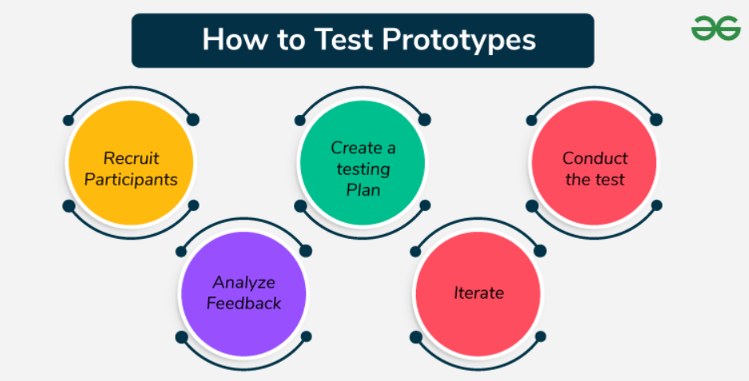

# Prototyping and Assumption Testing

## What is a Prototype?

A prototype is a basic, early version of your product used to test ideas quickly.

- It’s not fully built—just enough to show how the product might look or work.
- The goal is to validate user needs or assumptions before full development.

## Why Prototype Instead of Building Directly?

Building the full product is time-consuming and resource-heavy. If it fails, that effort is wasted.

**Prototyping helps you:**
- Test ideas early and affordably.
- Discover what users actually want before full-scale development.

## Connection to the Opportunity Solution Tree

Prototypes act as experiments within the Opportunity Solution Tree (OST).

- Once you identify a solution, use a prototype to test if it solves the user problem.
- This reduces risk by focusing only on what works.

## Types of Prototypes

### Low-Fidelity Prototypes
- Rough and simple, like paper sketches or wireframes.
- Used to test broad ideas early in the process.

### High-Fidelity Prototypes
- More realistic and detailed, may include interactivity.
- Not fully functional, but used to test closer to the real user experience.

## How to Test Prototypes

### 1. Recruit Participants
- Find users who match your target audience.

### 2. Create a Testing Plan
- Set goals and decide how many people to test.
- Choose metrics (e.g., task success rate, ease of use).

### 3. Conduct the Test
- Let users interact with the prototype.
- Observe behavior and ask follow-up questions.

### 4. Analyze Feedback
- Look for patterns in what users liked or struggled with.
- Identify confusing or missing features.

### 5. Iterate
- Improve the prototype based on user feedback.
- Make minor tweaks or redesigns as needed.

# Assumption Testing

## What is Assumption Testing?

Assumption testing is about checking your beliefs or guesses about users, product features, or the market.

- It uses real data and experiments to confirm what’s true.
- The goal is to avoid costly mistakes and make better product decisions.

## Importance of Assumption Testing in Product Management

- **Reduces Risk**: Ensures your ideas are based on facts, not guesses.
- **Saves Resources**: Avoids wasting time and money on features no one needs.
- **Improves Product-Market Fit**: Helps build something users actually want.
- **Enhances Decision Making**: Supports smart, evidence-based planning.

## Common Types of Assumptions

### 1. User Needs and Behaviors
- Beliefs about what users want or how they’ll use your product.
- **Example**: “Users prefer mobile-first apps.”

### 2. Market Size and Potential
- Assumptions about the size or growth of your market.
- **Example**: “We can reach 10,000 paying users in Year 1.”

### 3. Technical Feasibility
- Beliefs about whether your team can build something within time or budget.
- **Example**: “This feature will only take 2 months to develop.”

### 4. Business Viability
- Ideas around pricing, revenue, and sustainability.
- **Example**: “Users will pay ₹199/month for this tool.”

## Assumption Testing Methods

| **Method**         | **Purpose**                                              |
|--------------------|----------------------------------------------------------|
| **User Interviews**| Talk to users and understand real needs                  |
| **Surveys**        | Collect opinions and spot patterns in larger groups      |
| **A/B Testing**    | Test two variations to see which performs better         |
| **Concierge MVP**  | Deliver services manually before automating              |
| **Landing Page**   | Gauge interest based on clicks/signups on a simple page  |

## How to Write Assumption Statements

- **Specific**: Focus on one clear belief  
  _e.g., “Users prefer app notifications over emails.”_
- **Measurable**: Define what success looks like  
  _e.g., “At least 60% of users click on the notification.”_
- **Actionable**: Should lead to decisions  
  _e.g., “If fewer than 30% click, we’ll switch to email updates.”_

## Example Scenario

You’re building an app for freelance graphic designers.  
Assumptions might include:

- Designers prefer managing tasks on mobile, not desktop.
- Subscription pricing is acceptable to them.
- Time tracking and invoicing are must-have features.

**How to Test:**
- Interview freelance designers about their current tools.
- Send out surveys to understand payment preferences.
- Build a simple MVP to test how they use core features.

