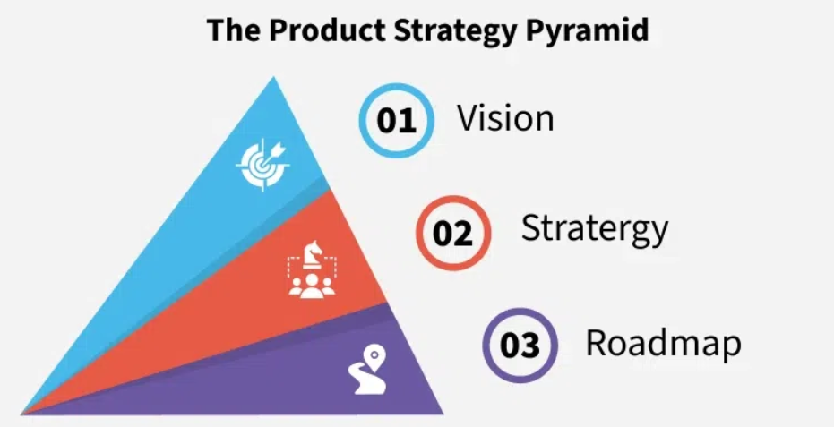
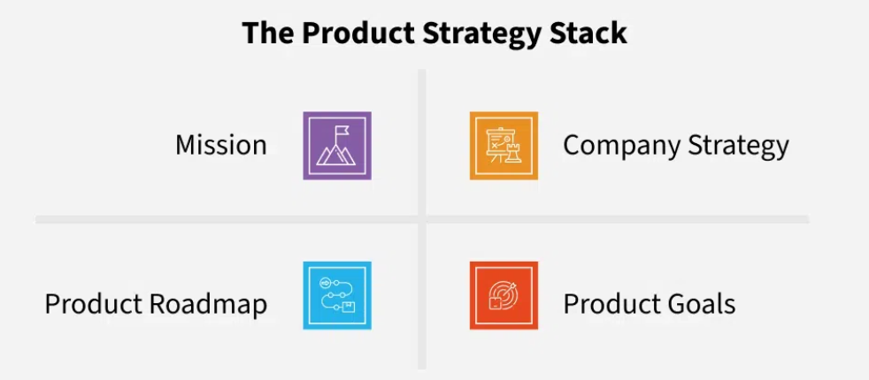

# Product Strategy, Vision, and Roadmaps: Core Concepts

## 1. Product Vision

**Definition**: A long-term aspirational goal that defines the purpose of the product.

**Purpose**: Answers *why* the product exists and what ultimate value it aims to provide.

**Role**:
- Aligns the organization on a shared goal.
- Inspires teams and informs all product decisions.
- Acts as a north star guiding long-term direction.

## 2. Product Strategy

**Definition**: The approach taken to achieve the product vision.

**Components**:
- Market opportunities  
- Target user segments  
- Key differentiators  
- Business goals

**Role**:
- Translates vision into actionable, measurable initiatives.
- Prioritizes work based on customer needs and market dynamics.
- Ensures competitive advantage and value delivery.

## 3. Product Roadmap

**Definition**: A tactical plan that outlines *what* will be built, *when*, and *why*.

**Components**:
- Timeline of features or releases  
- Resource estimates  
- Key milestones and dependencies

**Role**:
- Aligns internal stakeholders on short- and mid-term priorities.
- Tracks progress and adapts to changes.
- Communicates strategy execution clearly across teams.

## The Product Strategy Pyramid

  Product Vision
       |
 Product Strategy
       |
  Product Roadmap

- **Vision**: Sets the long-term direction.  
- **Strategy**: Charts the path to the vision.  
- **Roadmap**: Breaks the strategy into actionable steps.

## The Product Strategy Stack

### Mission
Company’s overarching purpose and desired impact.  
**Example**: *"To make remote collaboration seamless and human-centric."*

### Company Strategy
High-level business decisions (markets to enter, customer types to serve).  
Determines where to invest resources and how to win in the market.

### Product Goals
Measurable, time-bound outcomes that support the product strategy.  
**Examples**:  
- Improve activation rate by 20%  
- Increase mobile app retention  

### Product Roadmap
Execution plan that details when and how to achieve product goals.

## Why These Elements Matter

| Element         | Importance                                           |
|-----------------|------------------------------------------------------|
| Product Vision  | Inspires, aligns teams, and ensures long-term clarity. |
| Strategy        | Provides focused direction, guides decision-making.    |
| Roadmap         | Helps track execution and coordinate across departments. |
| Product Goals   | Ensure work is measurable, accountable, and prioritized. |

## Common Challenges in Strategy and Roadmapping

### Cross-Department Alignment
Difficulty in getting marketing, design, engineering, and sales on the same page.

### Changing Market Conditions
Need to frequently adjust strategy and roadmap without disrupting team focus.

### Limited Resources
Prioritizing the most impactful initiatives when budgets and time are tight.

