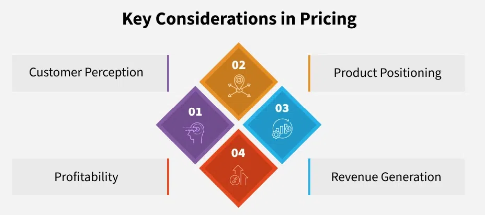
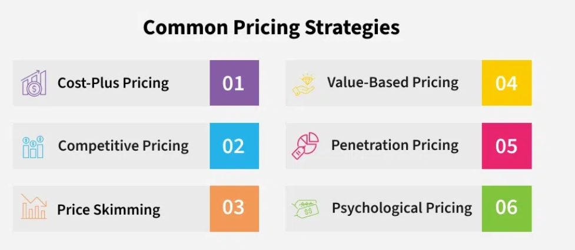

# What is Promotion?

**Promotion** is the way you communicate your product’s value to the world.

It's about:
- Spreading awareness
- Explaining benefits
- Motivating users to take action

# Key Promotion Strategies

Here are some common and effective ways to promote a product:

## 1. Advertising

**Paid promotions** to reach a broad or targeted audience.

Examples include:
- Billboards and posters (outdoor ads)
- Online ads on platforms like Google, Facebook, and Instagram

**Purpose**: Get quick attention and build awareness.

## 2. Public Relations (PR)

Focuses on shaping a positive public image and gaining trust.

Common methods:
- Press releases to media outlets
- Influencer partnerships
- Coverage in blogs, newspapers, or TV

**Purpose**: Build credibility and brand reputation.

## 3. Sales Promotions

**Short-term offers** to increase sales quickly.

Examples:
- Discounts or coupon codes
- Buy-one-get-one (BOGO) deals
- Limited-time offers during holidays or events

**Purpose**: Drive urgency and attract first-time buyers.

## 4. Social Media Marketing

Promoting your product on platforms like:
- Instagram
- Twitter
- LinkedIn
- Facebook

Types of content:
- Organic posts (stories, reels, carousels)
- Paid ads targeted by interests, behaviors, or location

**Purpose**: Increase engagement and drive conversions.

## 5. Content Marketing

Create valuable content to inform and attract your audience.

Content formats:
- Blog posts
- Case studies
- Videos and podcasts
- Infographics

**Purpose**: Educate users and build long-term trust.

# What is Testing?

**Testing** is the process of verifying that your product works correctly and meets quality standards.

- It helps identify bugs, performance issues, or usability problems.
- The main goal is to deliver a smooth and reliable experience to users.

# Types of Testing

## 1. Functional Testing
- Checks whether each feature works as expected.
- **Example**: Does the “Sign Up” button take users to the right page?

## 2. Performance Testing
- Ensures the product performs well under stress or high traffic.
- **Example**: Can the app load quickly with 10,000 users online?

## 3. Security Testing
- Looks for vulnerabilities that could be exploited.
- **Example**: Can user data be accessed without permission?

## 4. User Acceptance Testing (UAT)
- Involves real users testing the product to see if it meets their needs.
- **Goal**: Validate that the product solves the user’s problem.

## 5. Automated Testing
- Uses tools and scripts to test the product automatically.
- **Advantage**: Fast, repeatable, and useful for large codebases.

# Phased Rollouts

A **phased rollout** means releasing a product gradually—starting with a small group and expanding to a larger audience over time.

### Benefits:
- **Lower Risk**: Fewer users are affected if something goes wrong.
- **Early Feedback**: Get useful suggestions from initial users.
- **Performance Checks**: Monitor how the product behaves under increasing load.

# How to Conduct Effective Testing

## 1. Set Clear Goals
- Know exactly what you're testing and what success looks like.

## 2. Make a Test Plan
Include:
- What will be tested
- Who will test it
- How it will be tested
- What the expected results are

## 3. Run the Tests
- Execute test cases.
- Watch for bugs, crashes, or confusing user flows.

## 4. Document Everything
- Record what was tested, what passed, and what failed.
- Keep detailed notes for future reference.

## 5. Fix Issues and Retest
- Use results to improve the product.
- Run another round of testing to confirm fixes worked.

# Pricing Strategies

## Importance of Pricing

Pricing isn’t just about putting a number on your product—it influences:

- **Customer perception**
- **Profitability**
- **Market competitiveness**

Getting it right means balancing:
- What your product is worth
- What customers will pay
- What your business needs to succeed

## Key Considerations in Pricing

### • Customer Perception
- Price should reflect how users perceive your product’s value.
- High-quality products can justify higher prices.

### • Product Positioning
- Your brand's positioning impacts pricing.
- Premium products = premium pricing.
- Budget products = affordable pricing.

### • Profitability
- Price must cover production, marketing, and support costs.
- Too low = losses; too high = fewer customers.

### • Revenue Generation
- Aim for long-term growth, not just one-time profits.
- Sustainable pricing supports consistent income.

## Common Pricing Strategies

### 1. Cost-Plus Pricing
- **What it is**: Add a fixed markup to your production cost.
- **Pros**: Simple, ensures profit margin.
- **Best when**: Costs are stable, and competition is minimal.

---

### 2. Value-Based Pricing
- **What it is**: Price based on the product’s value to customers.
- **Pros**: Focuses on customer needs and perceived benefits.
- **Best when**: Your product is unique or solves major problems.

---

### 3. Competitive Pricing
- **What it is**: Align pricing with what competitors charge.
- **Pros**: Keeps you relevant in crowded markets.
- **Best when**: Products are similar and markets are saturated.

---

### 4. Penetration Pricing
- **What it is**: Start low to attract users, then raise prices.
- **Pros**: Builds user base quickly.
- **Best when**: Entering a new or competitive market.

---

### 5. Price Skimming
- **What it is**: Launch high, lower later.
- **Pros**: Captures early adopters at premium prices.
- **Best when**: Launching innovative or first-of-its-kind products.

---

### 6. Psychological Pricing
- **What it is**: Use price cues to influence perception (e.g., ₹99 vs ₹100).
- **Pros**: Feels more affordable to customers.
- **Best when**: Competing in retail or consumer-driven markets.
