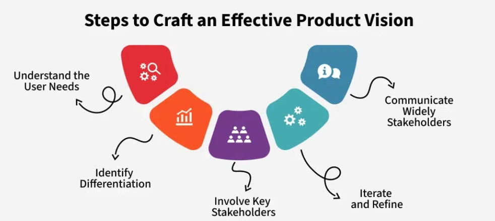

# Defining the "Why": Product Vision

A **product vision** explains *why* a product exists and what it aims to achieve in the long run.

- It gives the whole team — including developers, designers, and stakeholders — a clear goal to work toward.
- It acts as a guiding direction, helping teams make decisions that match user needs and business goals.

## Comparison Table: Company Vision vs. Product Vision

| Aspect         | Company Vision                                                 | Product Vision                                                       |
|----------------|----------------------------------------------------------------|------------------------------------------------------------------------|
| **Definition** | Describes the overall mission and future goals of the company. | Describes what a specific product aims to do and why it matters.      |
| **Focus**      | Broad focus — covers the entire company.                       | Narrow focus — specific to one product and its users.                 |
| **Example**    | "To be earth's most customer-centric company..." (Amazon)      | "Paper is... the inspiration for the Kindle of the future..." (Amazon Kindle) |

## Steps to Craft an Effective Product Vision

### Understand Your Users
- Research your target users — their problems and needs.
- A vision based on real user needs is more likely to succeed.

### Know What Makes You Different
- Identify your product’s unique edge: better design, price, tech, or features.

### Include Key People
- Collaborate with leadership, marketing, engineering, and other teams.
- Ensures alignment and broad acceptance.

### Update as You Learn
- Vision isn’t fixed — revisit and revise based on feedback or market shifts.

### Share It Clearly
- Communicate the vision consistently across meetings, documents, and presentations.
- Ensure everyone — from teams to stakeholders — understands it.

## Who Crafts an Effective Product Vision?

While **Product Managers** usually lead the process, it is built in collaboration with:

- Company leaders  
- Designers  
- Developers  
- Marketing and sales teams  

Together, these roles blend:
- User insights  
- Business goals  
- Market trends  

...into one **clear and motivating product vision**.

