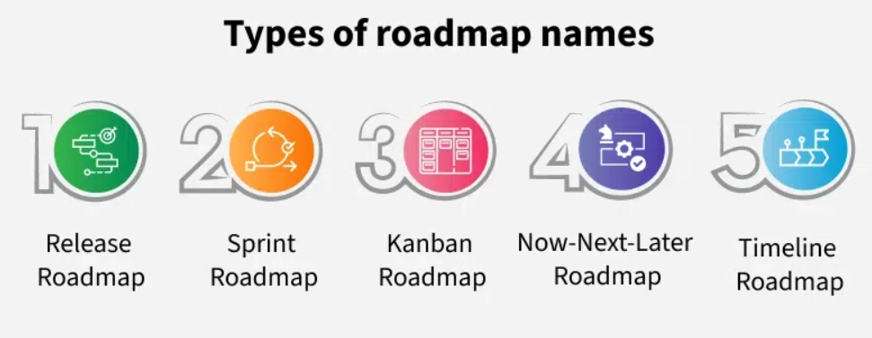

# Types of Product Roadmaps

Product roadmaps vary based on planning style, team structure, and product maturity. Below are five common types:

## 1. Release Roadmap

**Purpose**: Focuses on features or updates planned for specific product releases, not strict dates.

**Structure**: Organized by versions (e.g., Release 1, Release 2) with associated features.

**Use Case**: Suitable for products with phased releases across platforms (e.g., messaging apps).

**Strengths**:
- Clarifies feature scope per release.
- Provides flexibility around timelines.

**Limitations**:
- Lacks specific dates, which can be difficult for external stakeholders.

## 2. Sprint Roadmap

**Purpose**: Breaks down work into short-term goals aligned with Agile sprints (typically 1–2 weeks).

**Structure**: Organized by sprint with task status indicators like “planned,” “in progress,” or “completed.”

**Use Case**: Ideal for Agile teams using Scrum methodology.

**Strengths**:
- Clear short-term focus.
- Well-suited for iterative progress tracking.

**Limitations**:
- Not designed for long-term planning or strategic initiatives.

## 3. Kanban Roadmap

**Purpose**: Visualizes task flow across stages of development using Kanban principles.

**Structure**: Tasks move through columns such as “Backlog,” “Planned,” “In Progress,” and “Done.”

**Use Case**: Effective for teams managing ongoing or continuous workflows.

**Strengths**:
- Offers real-time visual progress tracking.
- Adapts well to changing priorities.

**Limitations**:
- No specific deadlines or delivery estimates.
- Less structured for milestone-based planning.

## 4. Now-Next-Later Roadmap

**Purpose**: Communicates current, upcoming, and future work without assigning timelines.

**Structure**:
- **Now**: Tasks in active development.
- **Next**: Upcoming priorities.
- **Later**: Future initiatives.

**Use Case**: Best for flexible, evolving product strategies.

**Strengths**:
- Simple to maintain and easy to communicate.
- Prioritization-focused without timeline pressure.

**Limitations**:
- No concrete delivery expectations.
- Stakeholders may require additional clarity on timing.

## 5. Timeline Roadmap

**Purpose**: Lays out when specific tasks or features will begin and end.

**Structure**: Features are plotted on a calendar or Gantt chart with start and end dates.

**Use Case**: Useful for aligning with marketing or sales initiatives requiring deadline visibility.

**Strengths**:
- Clear visibility into timing and sequencing.
- Helps coordinate across departments.

**Limitations**:
- Less flexibility to adapt to change.
- Delays in one area can disrupt the entire roadmap.

## Tools for Roadmap Creation

- **Productboard**: Customizable views, prioritization, and user insights.
- **Aha!**: Strategic planning and stakeholder communication.
- **Jira**: Useful for Agile teams to manage sprints, backlogs, and integrated roadmaps.

