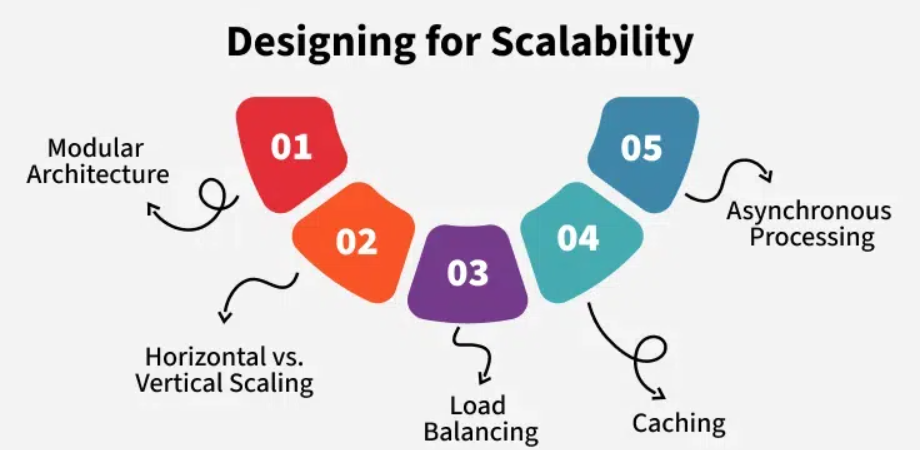
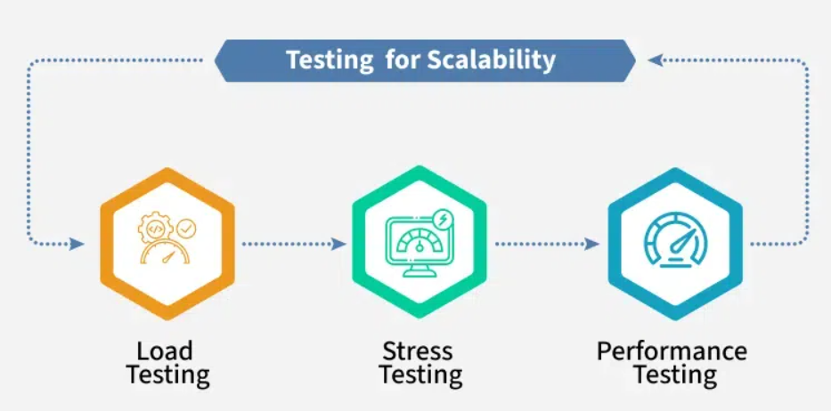

# Scalability

Scalability is a product’s ability to grow (in users, data, or operations) without losing performance or reliability.  
It is a nonfunctional requirement that ensures the system stays efficient under increased load.

## 3 Pillars of Scalability

### Performance
- Measured by load times (how quickly actions complete).
- Faster response times = better user experience.

### Capacity
- Maximum number of concurrent users/requests the system can handle.
- **Example**: IRCTC handles thousands of simultaneous users.

### Reliability
- Measured by uptime (e.g., 99.99% availability).
- Crucial for services like banking or global apps.

## Why Scalability Matters

- **Increase Revenue**: Handle more users, expand to new markets.
- **Improve User Experience**: Consistent speed and availability.
- **Enhance Business Agility**: Easily adapt to new tech (e.g., AI).
- **Reduce Operational Costs**: Efficient resource usage reduces overhead.

## Designing for Scalability

### Modular Architecture
- Break product into small, independent components.
- Easier to update or replace parts.

### Horizontal vs. Vertical Scaling
- **Horizontal**: Add more servers.
- **Vertical**: Upgrade existing server’s hardware.

### Load Balancing
- Distribute requests across servers.
- Avoids overload, maintains speed.

### Caching
- Store static/frequently-used data closer to users.
- **Example**: Food app caches images/dish names, fetches prices dynamically.

### Asynchronous Processing
- Load essential data first, process remaining in background.
- **Example**: Restaurant listings appear immediately, rest loads as you scroll.

## Testing for Scalability

### Load Testing
- Simulate expected user load.
- Observe system under normal use.

### Stress Testing
- Push system beyond normal limits.
- Identify breaking points.

### Performance Testing
- Measure response time, CPU usage, memory, etc.
- Ensures system handles demand efficiently.

