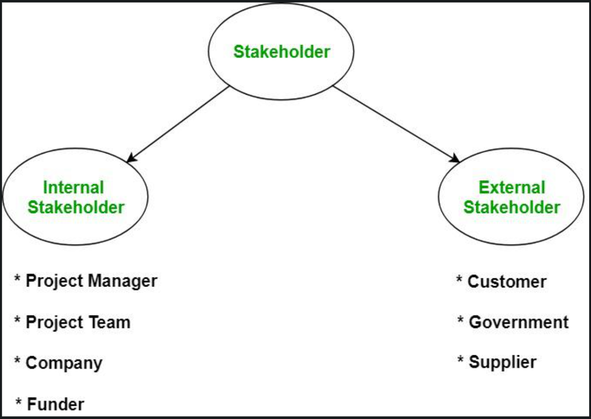

# Who Are Stakeholders?

Stakeholders are individuals, groups, or entities who have an **interest**, **concern**, or are **impacted** by a product, project, or organization.  
They can **influence** or be **influenced by** the product’s decisions and outcomes.

## Types of Stakeholders

### 🔹 Internal Stakeholders  
People **within** the organization who are involved in product creation and decision-making.  
Examples: Product Managers, Developers, Designers, Marketers, Executives.

### 🔹 External Stakeholders  
People or groups **outside** the organization who are affected by or influence the product.  
Examples: Customers, End Users, Investors, Partners, Regulators, Competitors.

## Further Classification

- **Key Stakeholders**: High influence + high interest. Often senior leaders, major investors, or strategic partners.  
- **Users**: The end-users of your product — their needs must shape development.  
- **Supporting Stakeholders**: Provide tools, services, or support (e.g., suppliers or external vendors).  
- **Core Team Stakeholders**: UX Designers, Developers, and QA teams essential to product delivery.

# Product Trio

In digital product development, the **Product Trio** are the 3 key roles that collaborate daily:

### Product Manager  
- Defines product vision  
- Prioritizes features  
- Aligns team with business and user needs

### UX/UI Designer  
- Crafts intuitive interfaces and flows  
- Focuses on usability and accessibility  
- Ensures design meets user expectations

### Technical Lead / Developer  
- Builds the product architecture  
- Ensures scalability, performance, and quality  
- Bridges design with engineering

These three roles are at the core of building great digital products.  
Together, they balance what’s **valuable**, **usable**, and **technically feasible**.

