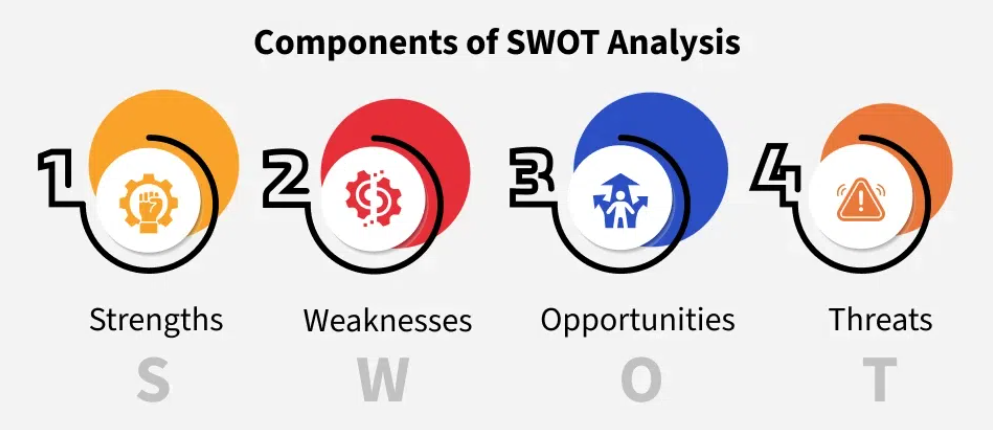

# SWOT Analysis

SWOT is a powerful tool for product managers to plan smartly by breaking down internal strengths and weaknesses, and external opportunities and threats.

## What is SWOT Analysis?

- **S**trengths  
- **W**eaknesses  
- **O**pportunities  
- **T**hreats  

It’s a framework used to:

- Evaluate internal & external factors
- Analyze products, projects, businesses, or careers

## How Can Product Managers Use SWOT?

### 🔹 Strategic Planning
- Understand where the product stands
- Set clear short- and long-term goals

### 🔹 Decision Making
- Focus on strengths and improve weaknesses
- Allocate resources wisely

### 🔹 Product Development
- Spot strong and weak areas in the product
- Prioritize new features based on market needs

### 🔹 Marketing Strategy
- Highlight strengths in campaigns
- Plan for risks and weak spots

### 🔹 Competition Analysis
- Compare with rivals
- Identify differentiators and gaps

## Components of SWOT Analysis

### 🔹 Strengths (Internal)
Advantages that help your product succeed.

Examples:
- Advanced technology
- Skilled product team
- Strong brand presence
- Exclusive partnerships

### 🔹 Weaknesses (Internal)
Challenges or limitations from within.

Examples:
- Limited funding or resources
- Poor tool integration
- Outdated tech stack
- Gaps in team expertise

### 🔹 Opportunities (External)
Chances to grow or improve in the market.

Examples:
- Rising trends in your domain
- Customer demands shifting
- New technology availability
- Untapped market segments

### 🔹 Threats (External)
Risks or barriers outside your control.

Examples:
- Strong or new competitors
- Changing government policies
- Economic downturn
- Bad press or social sentiment

## Applying SWOT Analysis: Step-by-Step

## Example: SWOT for a Social Media App

| **Category**     | **Examples**                                                                 |
|------------------|-------------------------------------------------------------------------------|
| **Strengths**     | High user engagement, unique features, loyal user base                       |
| **Weaknesses**    | Heavy reliance on ads, privacy concerns                                       |
| **Opportunities** | Rise of AR/VR in social, expand to new countries                              |
| **Threats**       | Data regulation changes, new rivals entering the space                        |
