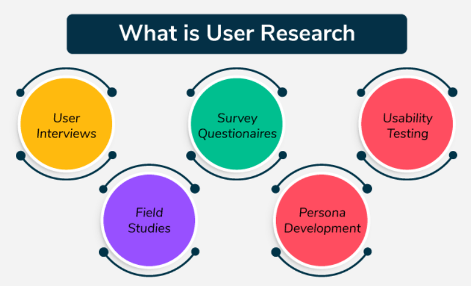
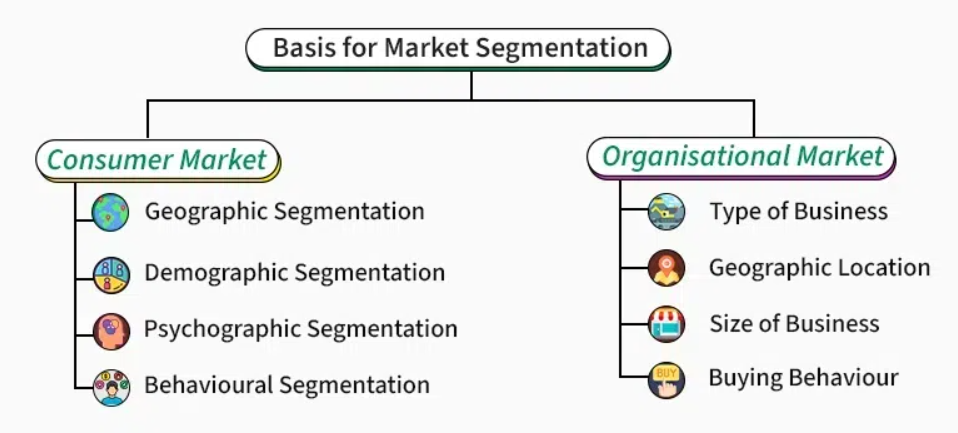

<style>
  hr.section-break {
    border: none;
    height: 3px;
    background: linear-gradient(to right, #4b6cb7, #182848);
    margin: 40px 0;
    border-radius: 2px;
  }

  hr.topic-divider {
    border: none;
    height: 1.5px;
    background-color: #888;
    margin: 30px 0;
    opacity: 0.6;
  }

  hr.soft-line {
    border: none;
    height: 1px;
    background-color: #ccc;
    margin: 20px 0;
    opacity: 0.5;
  }
</style>


## What is Market Research?

Market research means collecting and analyzing information about your market—like buyers, sellers, and industry trends—to make better business decisions.

<hr class="topic-divider">

### Types of Market Research

**1. Primary Research**

* First-hand data collection (e.g. interviews, surveys, user observations)
* Directly talking to users and sellers

**2. Secondary Research**

* Using data collected by others (e.g. articles, reports, websites)
* Example: Googling “market size of jewelry in India”

<hr class="soft-line">

### Qualitative vs. Quantitative Research

| Type         | Focus                      | Example                                 |
| ------------ | -------------------------- | --------------------------------------- |
| Qualitative  | User emotions, motivations | Why people prefer gold jewelry          |
| Quantitative | Measurable data            | 37% of 5,000 people prefer gold jewelry |

<hr class="topic-divider">

## What is User Research?

User research is a part of market research that focuses only on your **users**—their needs, pain points, and how they interact with your product.

### User Research Methods:

* **User Interviews**: One-on-one conversations
* **Surveys**: Collect opinions from many users
* **Usability Testing**: Watch how users use your product
* **Field Studies**: Observe users in real-world settings
* **Persona Development**: Create fictional characters that represent real users

<hr class="topic-divider">

### Case Study: Airbnb

Airbnb used research to understand what users needed before launching. A major concern was safety. By addressing this in their platform design, they built trust—and their success followed.

<hr class="section-break">

# Market Segmentation and Targeting

## What is Market Segmentation?

Dividing the market into smaller groups based on common traits—so you can target them more effectively.

<hr class="topic-divider">



### Types of Market Segmentation

**1. Geographic**

* Based on location
* Example: Spotify targets Indian users because of high internet usage

**2. Demographic**

* Age, income, gender, etc.
* Example: Gen Z vs. Millennials with different subscription plans

**3. Psychographic**

* Lifestyle, values, interests
* Example: Podcast fans vs. casual music listeners

**4. Behavioral**

* Usage habits
* Example: Morning vs. late-night music listeners

<hr class="topic-divider">

## Why Segmentation and Targeting Matter

* **Efficient Resource Use**: Spend time and money where it matters most
* **More Effective Marketing**: Tailored strategies perform better
* **Higher Conversions**: Targeted users are more likely to respond

<hr class="topic-divider">

## Steps for Effective Segmentation and Targeting

```
Identify Market Needs
        |
        v
Segment the Market
        |
        v
Evaluate Segments
        |
        v
Select Target Segment
```

<hr class="soft-line">

### Evaluating Market Segments

| Criteria      | What to Check For                        |
| ------------- | ---------------------------------------- |
| Size & Growth | Is the segment large and growing?        |
| Profitability | Will it generate good revenue?           |
| Reachability  | Can you reach and communicate with them? |
| Company Fit   | Does it align with your values & skills? |

<hr class="topic-divider">

## Real-World Example: Spotify for Gym-Goers

**Product Improvements**

* Gym-specific playlists with fast, energetic music

**Marketing Strategies**

* Partner with gyms and influencers
* Run fitness-focused ad campaigns

<hr class="section-break">

## Conclusion

Market and user research help you build what people **actually need**. Segmentation makes sure you're talking to the **right people** in the **right way**. Together, they make your product more valuable—and your strategy smarter.

<hr class="section-break">


